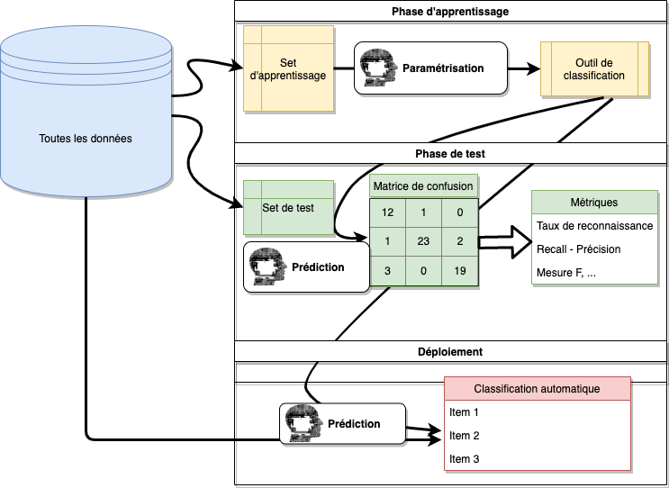

# (PART) SDD III : exploration et prédiction {-}

# Classification supervisée I {#classif1}

```{r setup, results='hide', warning=FALSE, include=FALSE}
SciViews::R
```

##### Objectifs {-}

- Comprendre le principe général de la classification supervisée

- Être capable d'utiliser l'analyse discriminante linéaire pour faire de la classification supervisée

- Maîtriser les matrices de confusion

- Comprendre la logique et être capable d'utiliser les différentes métriques calculables sur base de la matrice de confusion

##### Prérequis {-}

Si ce n'est déjà fait, vous devez installer et vous familiariser avec la 'SciViews Box' nouvelle mouture. RStudio et (R) Markdown ne doivent plus avoir de secrets pour vous. Vous devez aussi maîtriser les bases de Git et de GitHub (avoir un compte GitHub, être capable de cloner un dépôt localement, travailler avec GitHub Desktop pour faire ses "commits", "push" et "pull"). L'ensemble de ces outils a été abordé dans le cours de [science des données biologiques partie 1]( `r paste(learndown$baseurl, "sdd-umons", sep = "/")` ).

Nous avons déjà abordé dans le cours de [science des données biologiques partie 2]( `r paste(learndown$baseurl, "sdd-umons2", sep = "/")` ) la notion de **classification non supervisée**. De même, la modélisation (via les **régressions**) a aussi fait l'objet d'une attention particulière dans le cours précédent. Toutes ces connaissances vont servir de pilier de base pour ce que nous étudierons ensemble dans ce module, ainsi que dans les deux suivants concernant la classification supervisée.

## Principes de base

Rappelez-vous, la **classification** sert à regrouper les individus d'un jeu de données en différents groupes ou **classes**. Lorsque vous avez utilisé la classification hiérarchique ou le dendrogramme, vous avez réalisé de la classification _non_ supervisée. La classification _non_ supervisée permet de choisir des classes librement sur base de l'information contenue dans le jeu de données. 

Nous allons aborder maintenant la **classification supervisée**. La classification supervisée permet d'utiliser un ordinateur pour lui faire apprendre à classer des objets selon nos propres critères que nous spécifions par ailleurs (*"machine learning"* en anglais). Par exemple, en biologie, nous sommes amenés à classer le vivant (la fameuse classification taxonomique selon la [nomenclature binomiale de Linné](https://www.tela-botanica.org/2018/11/carl-von-linne-pere-de-la-classification-des-plantes-missionbotanique/)). Nous pourrions être amenés à nous faire seconder par un ordinateur pour classer nos plantes en herbier, nos insectes en collections, ... ou nos photos d'oiseaux ou de poissons. A partir du moment où nous pouvons collecter ou mesurer différents caractéristiques quantitatives ou qualitatives sur chaque individu, et que pour certains, nous en connaissons le nom scientifique, la classification supervisée pourrait être utilisée pour classer automatiquement d'autres individus, uniquement sur base des mêmes mesures.

```{block2, type='note'}
Les techniques de classification supervisée font l'objet d'une effervescence toute particulière ces derniers temps, en particulier dans leurs versions "deep learning". Ces méthodes sont, en général (mais pas obligatoirement pour les approches plus traditionnelles) appliquées sur de très gros jeux de données contenant des dizaines de milliers, des centaines de milliers, voire des millions, ou d'avantage d'observations. C'est précisément ce très grand nombre d'observations qui mérite que nous essayions d'automatiser leur classement.
```

Un jeu de données est composé d'observations (les lignes du tableau) et de variables (les colonnes du tableau) sur ces observations. En classification supervisée, les observations se nomment les **items** (nos différents spéciments de plantes, insectes, ...) et les variables se nomment les **attributs** (les variables quantitatives ou qualitatives mesurées sur chaque spécimen). 

En taxonomie assistée par ordinateur, nous cherchons donc à accélérer le dépouillement de gros échantillons en identifiant de manière automatique (ou semi-automatique) la faune et/ou la flore qui le compose. L'approche la plus souvent employée est l'analyse d'image pour mesurer des caractères visuels sur ces photographies. Il s'agit donc d'une reconnaissance sur base de critères morphologiques. Les organismes qui composent la faune et/ou la flore sont les items et les critères morphologiques sont les attributs. Vous avez certainement déjà rêvé d'avoir quelqu'un qui fait vos identifications à votre place... pourquoi pas votre ordinateur\ ?!

Parmi tous les items, on va choisir un sous-ensemble représentatif que l'on classe manuellement sans erreur. On obtient donc un ensemble de groupes connus et distincts. On va diviser ce sous-ensemble en un **set d'apprentissage** pour entraîner l'algorithme de classification, et un **set de test** pour en vérifier les performances. 

La classification supervisée va se décomposer en réalité en trois phases. 



1. **Apprentissage**\ : un algorithme est **entrainé** (paramétré) pour classer les items sur base du **set d’apprentissage**.

2. **Test**\ : les **performances** de l’outil de classification (on dit aussi, le **classifieur**) sont évaluées à l’aide du **set de test**.

3. **Déploiement**\ : si le classifieur obtient des performances satisfaisantes, il est utilisé pour classer **automatiquement** tous les autres items du jeu de données.

Il y a de très nombreux domaines d'applications de ces techniques de classification supervisée de type *"machine learning"*. Par exemple en médecine, ces techniques s'utilisent pour analyser les mesures effectuées par un scanner, un système de radiographie aux rayons X, un électrocardiogramme ou électroencéphalogramme, ... pour y détecter des anomalies. Votre moteur de recherche favori sur Internet utilise ces techniques pour classer les pages en "pertinentes" et "non pertinentes". La reconnaissance vocale ou de l'écriture manuscrite entrent dans cette catégorie également, de même que l'analyse de sentiment sur base de texte (quelle est l'état d'esprit de l'auteur du texte sur base des mots et expressions qu'il utilise). Il faut s'attendre à ce que dans quelques années, des algorithmes plus efficaces, et des ordinateurs plus puissants pourront effectuer des tâches aujourd'hui dévolues à des spécialistes, comme le médecin spécialisé en radiographie pour l'exemple cité plus haut. Nous sommes même à l'aube des véhicules capables de conduire tous seuls, sur base de l'analyse des images fournies par leurs caméras\ !

### Conditions d'application 

Ces outils ont très certainement éveillé votre curiosité. Imaginez qu'à l'avenir il ne sera peut plus utile d'apprendre la classification des bourdons. Un ordinateur pourra le faire à votre place. 

Il y a néanmoins certaines conditions d'application à satisfaire préalablement afin de pouvoir utiliser efficacement le "machine learning"\ : 

- **Tous les groupes sont connus et disjoints**. Chaque item appartient à une et une seule classe (sinon, refaire un découpage plus judicieux des classes). Un individu ne peut appartenir simultanément à deux ou plusieurs classes, et nous ne pouvons pas rencontrer d'items n'appartenant à aucune classe. Éventuellement rajouter une classe fourre-tout nommée "autre" pour que cette condition puisse être respectée.

- **La classification manuelle est réalisée sans erreur** dans les sets d'apprentissage et de test. C'est une contrainte forte. Vérifiez soigneusement vos sets avant utilisation. Éventuellement, recourez à l'avis de plusieurs spécialistes et établissez un *consensus*, ou éliminez les cas litigieux... mais attention alors à ne pas déroger à la condition suivante\ ! 

- **Toute la variabilité est représentée dans le set d’apprentissage**. Vous devez vous assurer de rassembler les individus représentant toute la variabilité de chaque classe pour la phase d'apprentissage (et si possible de test aussi).

- **Les mesures utilisées sont suffisamment discriminantes entre les classes**. Vous devez vous arranger pour définir et mesurer des attributs qui permettent de séparer efficacement les classes. Vous pourrez le constater visuellement en représentant, par exemple deux attributs quantitatifs sur un graphique en nuage de points, et en y plaçant les items en couleurs différentes en fonction de leur classe. Si des regroupements bien distincts sont visible sur le graphique, vous êtes bons, ... sinon c'est mal parti. Utilisez éventuellement des techniques comme l'analyse des composantes principales (ACP) pour visualiser de manière synthétique un grand nombre d'attributs. L'**ingénierie et sélection judicieuse des attributs** est une partie cruciale, mais difficile de la classification supervisée de type "machine learning". L'apprentissage profond ("deep learning") tente de s'en débarrasser en incluant cette partie du travail dans le programme d'apprentissage lui-même.

- **Le système est statique\ : pas de changement des attributs des items à classer par rapport à ceux des sets d'apprentissage et de test**. Des situations typiques qui peuvent se produire et qui ruinent votre travail sont un été particulièrement chaud et sec par rapport aux saisons pendant lesquelles des plantes ont été prélevées pour le set d'apprentissage. Par conséquent, vos fleurs ont des caractéristiques morphologiques différentes suite à cette longue canicule et sont donc moins bien, voire, totalement mal classées. Un autre exemple serait le changement d'appareil d'IRM qui donne des images légèrement différentes du précédent. Le set d'apprentissage du premier IRM ne permet alors peut-être pas de créer un classifieur capable de classer valablement les analyses réalisées avec le second appareil.

- **Toutes les classes ont des représentants dans les sets**. Il parait assez évident que si le set d'apprentissage ne contient aucun item pour une classe, l'algorithme de classification nevpeut pas être entrainé à reconnaitre celle classe-là. Par contre, il est également indispensable que le set de test soit pourvu d'un minimum d'items par classe, afin d'établir correctement une estimation des performances du classifieur pour **chaque** classe. attention avec une répartition aléatoire entre apprentissage et test pour des très petits peus de données à ce que cette situation n'apparaissent pas par le biais du hasard.

En pratique, ces conditions d'application ne sont *pas* remplies strictement dans les faits, mais le but est de s'en rapprocher le plus possible. Par exemple, il est impossible en pratique de garantir qu'il n'y ait absolument *aucune* erreur dans les sets d'apprentissage et de test. Si le taux d'erreur reste faible (quelques pourcents voire encore moins), l'impact de ces erreurs sera suffisamment négligeable. Par contre, avec 20 ou 30% d'erreurs, par exemple, nous ne pourrons plus travailler valablement.

## Mesure de performances

Avant de nous lancer dans la découverte de différents algorithmes, nous devons nous intéresser aux outils et métriques qui permettent d'étudier la qualité d'un outil de classification dans l'étape de test.

### Matrice de confusion

L'outil le plus important pour évaluer la qualité d'un algorithme de classification supervisée est la **matrice de confusion**.

```{block2, type='warning'}
Le test (évaluation des performances d'un classifieur) doit toujours se faire sur un échantillon indépendant du set d’apprentissage. C'est pour cela que nous devons avoir deux sets indépendants\ : le set d'apprentisage et le set de test ne contenant pas les mêmes individus.
````

La matrice de confusion est représentée sous la forme d'un *tableau de contingence à double entrée* qui croise les groupes prédits par l'ordinateur avec les groupes prédits manuellement pour ces mêmes items. En cas de concordance, les items sont dénombrés sur la diagonale de cette matrice carrée. Donc, tous les dénombrements hors diagonale représentent des erreurs faites par l'ordinateur (en vertu de l'hypothèse de base que le classement manuel est fait sans ambiguïté et sans erreurs). 

|       | **Espèce 1**              | **Espèce 2**              | **Espèce 3**              | **Espèce 4**              |
| --------------------------- | ------------------------- | ------------------------- | ------------------------- | ------------------------- |
| **Espèce 1**                | **correct**                   | erreur            | erreur            | erreur            |
| **Espèce 2**                | erreur            | **correct**                   | erreur            | erreur            |
| **Espèce 3**                | erreur            | erreur            | **correct**                   | erreur            |
| **Espèce 4**                | erreur           | erreur            | erreur            | **correct**                   |

Prenons cette matrice de confusion qui s'intéresse à trois fruits.

```{r, echo=FALSE, message=FALSE}
conf <- data.frame( "Orange" = c( 25, 0, 1), "Mandora" = c(0, 16, 9), "Mandarine" = c(0,8, 18),  row.names = c("Orange", "Mandora", "Mandarine"))

knitr::kable(conf, col.names = c("Orange", "Mandora", "Mandarine"),caption = "Matrice de confusion dont les colonnes représentent la classification par ordinateur et les lignes la classification manuelle.")
```

Quel que soit le nombre de classes, il est toujours possible de réduire la matrice de confusion dès lors qu'on se focalise sur *une* classe en particulier. Par exemple, si nous nous intéressons à la qualité de notre algorithme pour classer les mandoras, nous pouvons réduire notre matrice de confusion de la manière suivante (deux matrices simplifiées similaires peuvent naturellement être calculées pour les deux autres classes, orange et mandarine).

```{r, echo=FALSE, message=FALSE}
mandora <- data.frame("Mandora" = c("TP = 16", "FP = 9"), "Pas mandora" = c("FN = 8", "TN = 44"),   row.names = c("Mandora", "Pas mandora"))

knitr::kable(mandora,col.names = c("Mandora", "Pas mandora"), caption = "Matrice de confusion dont les colonnes représentent la classification par ordinateur et les lignes la classification manuelle pour les mandoras.")
```

Les paramètres principaux sont\ :

- TP : Vrai positif (*True Positive*). C'est le nombre d'items du groupe d'intérêt correctement classé. Concernant nos mandoras, il s'agit du nombre d'items classé comme des mandoras par l'ordinateur et qui sont des mandoras.

- TN : Vrai négatif (*True Negative*). C'est le nombre d'items classé dans tous les autres groupes comme un autre groupe. Concernant nos mandoras, il s'agit du nombre d'items qui ne sont pas classé comme des mandoras et qui ne sont pas des mandoras. 

- FP : Faux positif (*False Positive*). C'est le nombre d'items des autres groupes qui sont classé dans notre groupe d'intérêt. Concernant nos mandoras, il s'agit du nombre d'items classé comme des mandoras par l'ordinateur et qui ne sont pas des mandoras. 

- FN : Faux négatif (*False Negative*). C'est le nombre d'items classé dans le groupe d'intérêt qui sont d'un autre groupe. Concernant nos mandoras, il s'agit du nombre d'items qui ne sont pas classé comme des mandoras par l'ordinateur mais qui en sont. 

##### À vous de jouer ! {-}

`r h5p(21, height = 270, toc = "Vrais et faux positifs ou négatifs")`

### Métriques de performance

De très nombreuses métriques existent afin de quantifier l'ajustement d'un modèle sur base de la matrice de confusion. 

```{r, echo=FALSE, message=FALSE}
conf_mat <- data.frame("Positif" = c("TP", "FP"), "Négatif" = c("FN", "TN"), row.names = c("Positif", "Négatif"))

knitr::kable(conf_mat, caption = "Matrice de confusion théorique dont les colonnes représentent la classification par ordinateur et les lignes la classification manuelle.")
```

Partons d'un exemple fictif afin d'illustrer les calculs\ :

```{r}
# Classification manuelle en 3 classes A, B, C (la "vérité")
manu <- c("A", "B", "C", "A", "A", "C", "B", "C", "B", "B")
# Classification automatique (par l'ordinateur)
auto <- c("B", "B", "C", "C", "A", "C", "B", "C", "A", "B")

# Matrice de confusion
matconf <- table(Manuel = manu, Automatique = auto)
knitr::kable(as.matrix(matconf),
  caption = "Données fictives de classification en trois classes A, B et C.")
```

- Taux de reconnaissance global (*Accuracy*)

$$acc(\%) = \frac{(TP+TN)}{(TP+TN+FP+FN)}\cdot 100$$

Il s'agit d'une métrique qui quantifie globalement le modèle et qui se généralise facilement à plus de deux classes. Si vous observez bien les termes dans l'équation, vous constaterez que c'est en fait la somme des valeurs sur la diagonale divisée par la somme totale. Cela nous mène au calcul à la main suivant dans R, sachant que `diag()` extrait les éléments sur la diagonale d'une matrice carrée\ :

```{r}
# Taux global de reconnaissance (en %)
acc <- (sum(diag(matconf)) / sum(matconf)) * 100
acc
```

- Erreur globale (*Error*)

$$err = 100 - acc(\%) = (1-\frac{(TP+TN)}{(TP+TN+FP+FN)}) \cdot 100$$

L'erreur globale est donc, le complément du taux de reconnaissance global et la somme des deux est toujours de 100%.

```{r}
# Erreur globale (en %)
100 - acc
```

- Rappel (*Recall*) 

$$recall(\%) = \frac{TP}{(TP+FN)} \cdot 100$$

Dans la littérature, vous pouvez également retrouver les noms suivants\ : taux de vrais positifs *True Positive Rate (TPR)*, sensitivité *Sensitivity*, *Power*, *Probability of detection*. Le rappel est une métrique centrale dans la mesure où elle se focalise, pour une classe donnée, sur la fractions d'items du set d'apprentissage que l'ordinateur a pu trouver. Cela répond donc à une question particulière du type\ : "est-ce que je suis capable d'aller trouver mes items d'intérêt dans l'ensemble". Donc, pour les métriques qui s'intéressent à une classe en particulier (c'est valable pour les suivantes également), nous en avons autant que de classes. Voici comment on calcule le rappel pour les classes A, B et C à la main dans R sur notre exemple fictif\ :

```{r}
# Rappel pour la classe A (%)
recallA <- matconf[1, 1] / sum(matconf[1, ]) * 100
recallA
```

```{r}
# Rappel pour la classe B (%)
recallB <- matconf[2, 2] / sum(matconf[2, ]) * 100
recallB
```

```{r}
# Rappel pour la classe C (%)
recallB <- matconf[3, 3] / sum(matconf[3, ]) * 100
recallB
```

- Spécificité (*specificity*)

$$specif(\%) = \frac{TN}{(TN+FP)} \cdot 100$$
Dans la littérature, vous pouvez également retrouver les noms suivants\ : taux de vrais négatifs *True Negative Rate (TNR)*, sélectivité *Selectivity*. La spécificité apparaît complémentaire au rappel, même si traditionnellement, on complète souvent rappel par précision (voir ci-dessous). On peut aussi la calculer à partir du taux de faux positifs (FPR)\ :

$$FPR(\%) = \frac{FP}{TN + FP} \cdot 100$$

A partir du FPR, la spécificité se calcule alors comme son complément\ :

$$specif(\%) = 100 - FPR = (1-\frac{FP}{TN + FP}) \cdot 100$$

A noter aussi le taux de faux négatifs (FNR) qui est un point de vue complémentaire naturellement au taux de faux positifs \ :

$$FNR(\%) = \frac{FN}{TP + FN} \cdot 100$$

Pour calculer ces métriques à la main dans R sur notre exemple fictif, nous ferons\ :

```{r}
# Taux de faux négatifs (par ligne) pour A (en %)
FNR <- ((sum(matconf[1, ]) - matconf[1, 1]) / sum(matconf[1, ])) * 100
FNR
```

```{r}
# Taux de faux positifs (par colonne) pour A (en %)
# Notez que TN + FP est en fait tout sauf la première ligne
FPR <- ((sum(matconf[, 1]) - matconf[1, 1]) / sum(matconf[-1, ])) * 100
FPR
```

```{r}
# Spécificité pour A (en %)
specA <- 100 - FPR
specA
```

- Précision (*Precision*)

$$prec(\%) = \frac{TP}{(TP+FP)} \cdot 100$$

Dans la littérature, vous pouvez également retrouver les noms suivants\ : *Positive Predicted Value (PPV)*, *Reproducibility*, *Repeatability*. La précision s'intéresse à une question très différente du rappel, mais néanmoins complémentaire\ : "quelle est la fraction effectivement de classe X que l'ordinateur a classé comme X\ ?"

Un calcul manuel dans R donne\ :

```{r}
# Précision pour A (en %)
precA <- matconf[1, 1] / sum(matconf[, 1]) * 100
precA
```

Si la classification ne peut se faire sans erreurs (cas le plus fréquent), nous pouvons améliorer la précision mais au détriment du rappel, ou *vice-versa*. Selon le contexte, nous avons plutôt intérêt à favoriser l'un ou l'autre. Par exemple, pour le dépistage de la COVID-19, il vaut mieux un test avec un rappel le plus élevé possible (pour ne pas déclarer des patients malades comme faussement sains), quitte à sacrifier un peu la précision (avoir une fraction un peu plus grande de faux positifs dans la fraction de la population considérée comme atteinte par le test... et qui ferait une quarantaine inutilement). 

Dans d'autres situations, il vaut mieux, au contraire favoriser la précision. Si nous voulons inclure des sujets atteints d'une maladie rare dans une étude, nous n'aurons pas intérêt à échantillonner la population au hasard. En effet, notre échantillon contiendra trop d'individus sains par rapport aux rares malades. Nous pourrions alors utiliser la classification supervisée pour déterminer qui est malade ou sain, et ensuite effectuer un échantillonnage stratifié dans les deux classes (50% de chaque classe dans l'échantillon final pour notre étude). Évidemment dans ce cas, si la précision est très faible, nous aurons énormément de faux positifs dans la fraction détectée comme malade. Cela réduirait alors la représentativité des individus malades dans l'échantillon, par rapport à un classifieur qui montre une précision plus grande pour la classe des malades.

Ces deux exemples sont plutôt extrêmes. Dans la majorité des cas, nous recherchons plutôt un bon équilibre entre rappel et précision, et ce, pour toutes les classes. Les mesures suivantes de score *F* ou précision balancée tentent de synthétiser rappel et précision, ou rappel et spécificité en un seule nombre pour une classe données, afin de représenter au mieux cette recherche d'un compromis entre les deux.

- Score F (*F-measure*)

$$Fmeas = 2 \cdot \frac{(precision \cdot recall)}{(precision + recall)}$$

Dans la littérature, vous pouvez également retrouver les noms suivants\ : *F1-score*, *harmonic mean of precision and recall*

```{r}
# Mesure F ou F1-score pour A (en %)
2 * (recallA * precA) / (recallA + precA)
```

- Précision balancée (*Balanced accuracy*) 

$$ball\ acc = \frac{(specificity + recall)}{2}$$

```{r}
# Précision balancée pour A (en %)
(specA + recallA) / 2
```

##### À vous de jouer ! {-}

`r learnr("C01La_confusion", title = "Matrice de confusion", toc = "Matrice de confusion")`

##### Pour en savoir plus {-}

Vous pouvez retrouver des indices supplémentaires via le lien suivant\ : [Statistics calculated on confusion matrix](https://github.com/BioDataScience-Course/sdd_lessons/blob/2019-2020/sdd3_01/more/confusion_matrix.pdf)

## Analyse discriminante linéaire

Il existe de très nombreux algorithmes de classification supervisée. Nous allons commencer la découverte des principaux algorithmes avec l'**analyse discriminante linéaire**. Cette analyse recherche la meilleure discrimination possible des groupes par rotation des axes, en diagonalisant la **matrice variance-covariance inter-groupes**, ce qui revient à calculer les combinaisons linéaires des variables initiales qui séparent le mieux ces groupes.

```{block2, type = 'note'}
Le principe de cet algorithme ne te rappelle rien\ ? Evidemment que oui, cet algorithme se base sur les mêmes principes que l'ACP. 
```

Il n'est pas utile ici de rentrer dans les détails mathématiques. Comme vous connaissez déjà les variances inter/intra-groupes (cf. [ANOVA](https://wp.sciviews.org/sdd-umons/?iframe=wp.sciviews.org/sdd-umons-2020/anova-%25C3%25A0-un-facteur.html)) d'une part, et le principe de rotation des axes de l'[ACP](https://wp.sciviews.org/sdd-umons2/?iframe=wp.sciviews.org/sdd-umons2-2020/analyse-en-composantes-principales.html) d'autre part, vous êtes à même de comprendre le principe de l'ADL en combinant ces deux notions. Pour **quantifier la séparation des différents classes** ou groupes, nous allons donc réutiliser encore une fois la bonne vieille séparation de la variance totale en variance inter-groupe et variance intra-groupe que nous avons déjà employée, par exemple, dans l'ANOVA. Sauf qu'ici, nous travaillons en multivarié avec des matrices ayant potentiellement un grand nombre de dimensions. Du point de vue purement mathématique, cela ne change rien, car la partition de la variable s'applique tout aussi bien à *N* > 2 dimensions. Ensuite, nous nous intéressons aux **distances inter-groupes**. Notez que, plus ces distances sont importantes, mieux nous séparons les groupes (ou si vous préférez, les classes de notre classifieur).

Pour rappel, l'ACP est une technique qui effectue la **diagonalisation d'un matrice** (matrice variance-covariance, ou matrice de corrélation des données). D'un point de vue géométrique, nous avons vu que diagonaliser une matrice revient en fait à effectuer une **rotation du système d'axes** représenté par cette matrice, de sorte que les nouveaux axes ainsi obtenus correspondent à une **maximisation de la variance** sur les nouveaux axes. En ACP, on cherchait à "étaler" les données le plus possible sur les deux ou trois premiers axes afin de visualiser comment les points (les individus) se répartissent.

En ADL, on réutilise le même principe, mais nous substituons la matrice inter-groupes à la matrice variance-covariance pour effectuer cette ACP. Le résultat est une *autre* rotation des axes qui va maximiser, cette fois-ci, les distances inter-groupes... et donc, étaler au mieux les différentes classes de notre classifieur selon des axes qui les *séparent* le mieux possible linéairement (entendez par là, par une division à l'aide d'hyperplans qui sont les équivalents à *N* dimension de droites de séparation dans un plan à deux dimensions, voir schéma ci-dessous). Les hyperplans de séparations sont déterminés par rapport aux barycentres des différentes classes. En d'autres termes, ils sont placés à égale distance des centres de gravité des différents nuages de points dans la représentation en composantes principales de l'ADL.

À partir de là, l'espace est divisé en plusieurs régions dont les frontières son linéaires. Chaque région correspond à une classe. Il suffit alors de projeter des nouveaux individus dans cet espace (recalcul des coordonnées selon la rotation du système d'axes et représentation de ces coordonnées dans l'espace des individus de l'ADL). Nous regardons alors dans quelle sous-région nos points ont été se placer pour en déterminer la classe à laquelle ils appartiennent. Pour une autre explication, [voyez ici](https://od-datamining.com/knwbase/lanalyse-discriminante-expliquee-a-ma-fille/).


Cet algorithme présente l’avantage d’être simple et rapide à calculer. Par contre, l’ADL n’est généralement pas la méthode la plus performante en classification supervisée, et elle impose que les différents groupes soient décrits par des sous-espaces uniques et délimités par des hyperplans dans l’hyperespace des *p* variables initiales, soit, une hypothèse de départ très forte. Il est possible de restreindre l’outil de reconnaissance à *q* < *p* composantes discriminantes principales, afin de simplifier et d’accélérer le calcul, si cela s'avère nécessaire (les détails sortent du cadre de ce cours).

### Manchots antarctiques

Partons d'un exemple pratique sur trois populations de manchots adultes proches de la station de recherche PALMER en Antarctique. 

```{r}
SciViews::R
penguins <- read("penguins", package = "palmerpenguins")
```

La fonction `skim()` nous donne un aperçu du contenu de ce jeu de données. Si vous voulez des informations supplémentaires, consultez la page d'aide du jeu de données ou [palmerpenguins](https://allisonhorst.github.io/palmerpenguins/). 

```{r}
skimr::skim(penguins)
```

Ce jeu de données comprend `r ncol(penguins)` variables et `r nrow(penguins)` individus. La variable que nous cherchons à prédire ici est `species` (variable réponse). Trois espèces de manchots sont étudiées\ :

- Adelie (152 individus)
- Gentoo (124 individus)
- Chinstrap (68 individus)

Bien que nous n'ayons pas un *plan balancé* (même nombre d'items pour chaque niveau de notre variable réponse), les différences restent encore acceptables, soit un peu plus du simple au double entre Chinstrap et Adelie. Nous pourrions sous-échantillonner les espèces les plus abondantes mais nous diminuons alors la taille de notre jeu de données. Des techniques existent pour balancer le nombre d'items, dont la plus en vogue\ : [SMOTE ("Synthetic Minority Over-sampling")](https://rikunert.com/SMOTE_explained). Elle peut s'avérer utile ici, mais nous poursuivrons sans modifier artificiellement le nombre d'items dans notre jeu de données.

```{block2, type = 'info'}
En quoi un nombre différent d'items dans chaque classe peut-il poser problème en classification supervisée\ ? En fait comme la plupart des critères sont basés sur la fraction correcte prédite pour **l'ensemble** des données, en cas de différences extrêmes nous pourrions arriver à des situations paradoxales. Imaginez par exemple une maladie très rare. Nous avons un échantillon important de patients sains, mais forcément très peu de cas positifs. Par exemple, 1,5% de notre set d'apprentissage est constitué de patients malades. Dans ce cas, un classifieur trivial qui classerait tout le monde comme sain ferait globalement 98,5% de prédictions correctes. C'est difficile à battre, et en même temps pas très utile. Donc, deux points à retenir de ce cas fictif\ :

1. Toujours essayer de balancer les items dans les classes, mais sans exagaration (une différence du simple au double est encore gérable, pour fixer les idées),

2. Le point de référence pour définir si un classifieur est efficace dépend de la classe la plus abondante. Avec un plan balancé à deux classes, un classiifieur qui classe correctement 70% des items fait 20% mieux que le classement au hasard. Par contre, si la classe la plus abondante représente 75% du set, il fera *moins bien* de 5% qu'un classement purement au hasard (sic\ !)
```

On observe la présence de quelques données manquantes que nous supprimerons plus loin avant de faire notre analyse. Nous allons également renommer et donner un labels à nos variables quantitatives (nos attributs).

```{r}
penguins <- rename(
  penguins, bill_length = bill_length_mm, bill_depth = bill_depth_mm, 
  flipper_length = flipper_length_mm, body_mass = body_mass_g)

penguins <- labelise(penguins, 
    label = list(
      species = "Espèce", island = "Île", bill_length = "Longueur du bec",
      bill_depth = "Épaisseur du bec", flipper_length = "Longueur des nageoires", 
      body_mass = "Masse", sex = "Sexe", year = "Année de la mesure"),
    units = list(
      bill_length = "mm", bill_depth = "mm", flipper_length = "mm",
      body_mass = "g"))
```

Nous nous intéressons uniquement pour l'instant aux variables explicatives numériques, et nous éliminons également les lignes du tableau qui contiennent des valeurs manquantes. 

```{r}
penguins %>.%
  select(., -year, -island, -sex) %>.%
  drop_na(.) -> penguins
```

```{block2, type = 'warning'}
La fonction `drop_na()` est bien pratique pour obtenir un tableau de données propre sans aucunes valeurs manquantes. Cependant, elle est assez impitoyable\ : toute ligne du tableau qui contient au moins une valeur manquante est éliminée. Toujours sélectionner les valeurs que l'on veut retenir dans le modèle *avant* de l'appliquer, sinon, on retirera aussi des lignes pour lesquelles les variables qui ne nous intéressent pas ont aussi des valeurs manquantes (ici, le sexe). 
```

Le graphique ci-dessous propose un nuage de points pour différencier ces trois espèces selon seulement deux variables. On observe une répartition assez bonne entre nos trois espèces pour les deux variables représentées. Ce graphique nous laisse penser que l'algorithme de classification a de grandes chances d'être efficace pour séparer ces trois espèces, car le jeu de donnée montre une tendance claire. N'oublions pas que nous avons au total quatre attributs à disposition.

```{r}
chart(penguins, bill_length ~ flipper_length %color=% species) +
  geom_point() 
```

*N'hésitez pas à explorer par vous-même ce jeu de données\ : il y a en effet pas mal de graphiques intéressants à réaliser avant de se lancer dans une analyse plus approfondie... qui a dit "boites à moustaches"\ ? J'ai entendu "matrice de corrélation" là-bas au fond\ ? ...*

Le jeu de données est découpé en un **set d'apprentissage** et un **set de test**. On décide de garder 2/3 des observations pour le set d'apprentissage.

```{r}
n <- nrow(penguins)
n_learning <- round(n * 2/3)
n_learning
```

Nous séparons nos observations en deux sets indépendants. Nouys utilisons cependant la fonction `set.seed()` afin de fixer le début du générateur de nombres pseudo-aléatoires, ce qui donne une série de nombres qui ont les mêmes propriétés que des nombres tirés au sort, mais ce tirage au sort est *reproductible* d'une fois à l'autre. 

```{r}
set.seed(324)
# Récupération de n_learning items parmi les numéros de lignes de 1 à n
learning <- sample(1:n, n_learning)
# Sous-tableau correspondant à ces lignes -> apprentissage
penguins_learn <- penguins[learning, ]
# Sous-tableau ne correspondant pas à ces lignes -> test
penguins_test <- penguins[-learning, ]
```

Le set d'apprentissage comprend `r nrow(penguins_learn)` items et le set de test comprend `r nrow(penguins_test)` individus.

#### Apprentissage avec ADL

Nous utilisons le package {mlearning} pour réaliser notre analyse ici. La fonction `mlLda()` propose une structure que nous avons déjà employée à de nombreuses reprises. Il faut fournir le set d'apprentissage (`data =`) et la formule. Dans notre cas, nous souhaitons prédire l'espèce à l'aide de plusieurs attributs.

```{r}
library(mlearning)

penguins_lda <- mlLda(data = penguins_learn,
  species ~ bill_length + bill_depth + flipper_length + body_mass)
```

Cependant dans le cas particulier où **toutes** les variables du tableau sont utilisées pour l'analyse, comme c'est le cas ici, la formule peut être abrégée en `class ~ .`, ce qui signifie que la variable dépendante qualitative `class` est étudiée en fonction de **toutes** les autres variables du tableau, considérées toutes comme des attributs. En fait, ce n'est pas tout-à-fait synonyme car dans ce dernier cas, les fonction du package {mlearning} utilisent des astuces de programmation pour optimiser les calculs (autant en vitesse qu'en utilisation de la mémoire vive). Il est donc très fortement conseillé d'utiliser cette forme.

```{r}
# Utilisation de la forme condensée de notre formule
penguins_lda <- mlLda(data = penguins_learn, species ~ .)
penguins_lda
```

Nous pouvons visualiser nos données selon les deux premiers axes discriminants (notés `LD1` et `LD2`) à l'aide du graphique suivant\ :

```{r}
plot(penguins_lda, col = as.numeric(response(penguins_lda)))
```

Nous voyons bien que la séparation est très bonne. Gentoo est très clairement séparé des deux autres, tandis que la frontière entre Chnistrap et Adelie est un peu moins nette, mais toutefois clairement visible.

<details><summary>Visualisation des sous-régions correspondant aux trois espèces dans un plan.</summary>

Bien que {mlearning} ne propose aucune fonction pour visualiser le découpage que réalise l'ADL pour décider à quelle classe un point appartient, nous pouvons la créer avec un peu de code en R (les détails de cette fonction vont au delà de ce cours, mais si vous êtes curieux, vous pouvez inspecter le code pour comprendre comment elle fonctionne).

Pour visualiser ce qui se passe dans un plan à deux dimensions, nous allons refaire une prédiction à l'aide de deux variables seulement\ :

```{r}
penguins_learn %>.%
  select(., flipper_length, bill_length, species) -> penguins_learn2

penguins_lda2 <- mlLda(data = penguins_learn2, species ~ .)
summary(penguins_lda2)
```

Nous voyons que 70% de la variance inter-classe est sur `LD1` et 30% sur `LD2`. Un partitionnement dans le plan des variables de départ est obtenu comme suit\ :


```{r}
# predplot() function inspired from MASS, chap. 12, p. 340
predplot <- function(object, main = "", len = 100, ...) {
  pen_data <- as.data.frame(penguins_learn2)
  plot(pen_data[, 1], pen_data[, 2], type = "n", #log = "xy",
    xlab = "longueur des nageoires [mm]", ylab = "longueur du bec [mm]", main = main)
  for (il in 1:3) {
    set <- pen_data$species == levels(pen_data$species)[il]
    text(pen_data[set, 1], pen_data[set, 2],
      labels = substr(as.character(pen_data$species[set]), 1, 3), col = 1 + il)
  }
  xp <- seq(170, 235, length = len)
  yp <- seq(30, 60, length = len)
  penT <- expand.grid(flipper_length = xp, bill_length = yp)
  Z <- predict(object, penT, type = "both",...)
  zp <- as.numeric(Z$class)
  zp <- Z$membership[, 3] - pmax(Z$membership[, 2], Z$membership[, 1])
  contour(xp, yp, matrix(zp, len), add = TRUE, levels = 0, labex = 0)
  zp <- Z$membership[, 1] - pmax(Z$membership[, 2], Z$membership[, 3])
  contour(xp, yp, matrix(zp, len), add = TRUE, levels = 0, labex = 0)
  invisible()
}
predplot(penguins_lda2)
```

Effectivement, nous distinguons clairement que le plan a été divisé en 3 parties séparées par des segments de droites pour en délimiter les fromtières.

</details>

#### Phase de test

Nous allons maintenant vérifier les performances de ce classifieur à l'aide de la matrice de confusion et des métriques que nous pouvons en dériver. Nous commençons par prédire les classes de notre set de test avec notre objet `penguins_lda` (fonction `predict()` tout simplement). Si elle est appliquée sur l'objet classifieur sans aucun autre argument, ce sont les items du set d'apprentissage qui sont classés, sinon, on rajoute comme second argument le nom du tableau (de test par exemple).

```{r}
penguins_pred <- predict(penguins_lda, penguins_test)
penguins_pred
```

Cet object contient donc les `r nrow(penguins_test)` prédictions réalisées par notre classifieur. Nous réalisons un tableau de contingence à double entrée en croisant ces données avec les espèces déterminées par les spécialistes qui se trouvent dans la variables `species` de notre set de test (que la classifieur n'a, bien entendu pas utilisé pour faire ses prédictions). Dans le langage de la classification supervisée, ce tableau de contingence à double entrée s'appelle une **matrice de confusion** donc, et c'est un excellent outil pour étudier les performances de notre classifieur.

```{r}
# Argument 1: prédictions, argument 2: valeurs connues pour `species`
penguins_conf <- confusion(penguins_pred, penguins_test$species)
penguins_conf
```

La fonction `plot()` appliquée à notre objet `penguins_conf` de classe `confusion` nous donne une présentation visuelle colorée plus facile à lire que le tableau textuel brut (pensez à des cas plus complexes avec beaucoup plus de classes).

```{r}
plot(penguins_conf)
```

Notre classifieur a commis deux erreurs sur les données du set de test. Il semble que Gentoo puisse s'identifier sans erreurs par rapport aux deux autres espèces, alors qu'une erreur (faible) subsiste dans la discrimination entre Adelie et Chinstrap. On obtient tout le détail des métriques que nous avons vu précédemment en faisant appel à la fonction `summary()`.

```{r}
summary(penguins_conf)
```

##### À vous de jouer ! {-}

`r learnr("C01Lb_lda", title = "Analyse discriminante linéaire", toc = "Analyse discriminante linéaire")`

##### Pièges et astuces {-}

Tout comme cela avait déjà été expliqué lors de la présentation de l' [ACP]( `r paste(learndown$baseurl, "sdd-umons2/?iframe=wp.sciviews.org/sdd-umons2-2020/analyse-en-composantes-principales.html", sep = "/")` ), il est crucial de bien nettoyer son jeu de données avant de réaliser une ADL. Il est également très important de vérifier que les relations entre les variables prédictives (les attributs) sont linéaires dans le cas de l'analyse disciminante *linéaire*. Sinon il faut transformer les données de manière appropriée. Rappelez-vous que l’ADL s’intéresse aux corrélations linéaires entre vos variables.

#### Déploiement

Notre jeu de données ne reprenait que les données du set d'apprentissage et du set de test. Néanmoins, les scientifiques qui ont utilisé ces données pourraient légitimement considérer que le classifieur est suffisamment fiable pour pouvoir classer les trois espèces de manchots sur base des quatre mesures effectuées sur n'importe quel individu. Ainsi, s'ils possèdent par ailleurs des données biométriques sur les manchots de la région pour lesquelles il manque l'identification de l'espèce, ils pourraient utiliser leur classifieur pour les prédire. Si le jeu de donnée biométrique s'appelle par exemple `palmer2data`, ils feront tout simplement `predict(penguins_lda, palmer2data)` pour obtenir une prédiction des espèces de manchots pour les individus repris dans `palmer2data`.

##### À vous de jouer ! {-}

```{r, echo=FALSE, results='asis'}
if (exists("assignation"))
  assignation("C01Ga_ml1", part = "I",
    url = "https://github.com/BioDataScience-Course/C01Ga_ml1",
    course.urls = c(
      'S-BIOG-025' = "https://classroom.github.com/a/-5ulh9Fw"),
    toc = "Utilisation de l'analyse discriminante linéaire")
```

## Récapitulatif des exercices

Dans ce module 1, vous aviez à réaliser les exercices suivants\ :

`r show_ex_toc()`
