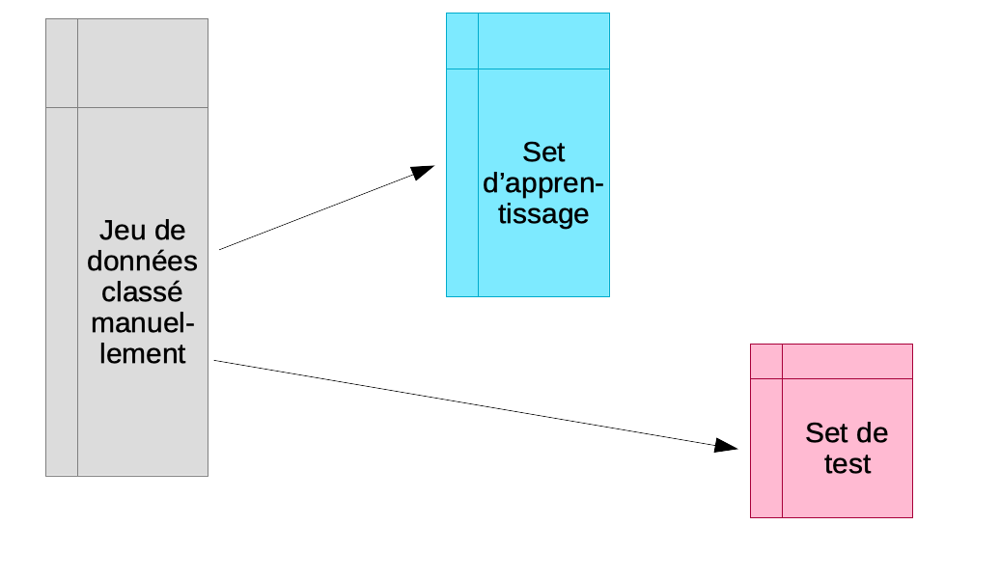
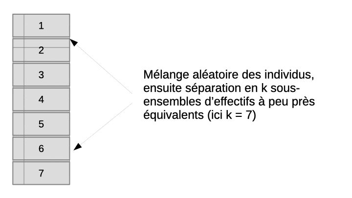
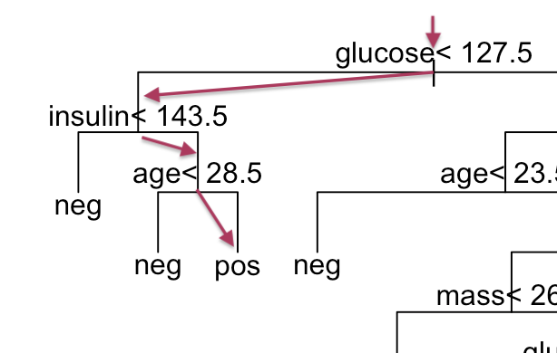

# Classification supervisée II {#classif2}

##### Objectifs {-}

- Maîtriser la validation croisée comme approche efficace de partitionnement entre set d'apprentissage et de test

- Connaître la classification supervisée par la méthode des plus proches voisins et par quantification vectorielle

- Comprendre et être capable d'utiliser les méthodes par arbres décisionnels (partitionnement récursif et forêt aléatoire)

##### Prérequis {-}

Ce module continue la matière vue dans le module précédent et s'appuie dessus. Assurez-vous d'avoir bien compris la logique de la classification supervisée et les trois étapes\ : apprentissage, test et déploiement. Vous devez être également capable de créer un classifieur avec R (en utilisant l'ADL). Enfin, la matrice de confusion et les métriques qui en sont dérivées ne doivent plus avoir de secrets pour vous pour évaluer les performances d'un classifieur dans la phase de test. S'il subsiste des doutes ou des incompréhensions pour ces aspects clés de la classification supervisée, vous feriez mieux d'approfondir le module 1 *avant* d'aborder celui-ci.

## Validation croisée

Rappelez-vous qu'une règle à laquelle il ne faut *jamais* déroger, c'est de ne pas utiliser les mêmes individus en apprentissage et en test.



Souvent, la grosse difficulté est d'obtenir suffisamment d'objets de chaque classe identifiés manuellement pour permettre à la fois l'apprentissage et le test. Un test sur les **mêmes** objets que ceux utilisés lors de l'apprentissage mène à une surestimation systématique des performances du classifieur. Nous sommes donc contraint d'utiliser des objets différents dans les deux cas. Naturellement, plus, nous avons d'objets dans le set d'apprentissage **et ** dans le set de test, et meilleur sera notre classifieur et notre évaluation de son efficacité.

La **validation croisée** permet de résoudre ce dilemme en utilisant en fin de compte *tous* les objets, *à la fois* dans le set d'apprentissage et dans le set de test, mais *jamais simultanément*. L'astuce consiste à diviser aléatoirement l'échantillon en *n* sous-ensembles à peu près égaux en effectifs. Ensuite, l'apprentissage suivi du test est effectué *n fois indépendamment*. A chaque fois, on sélectionne tous les sous-ensembles sauf un pour l'apprentissage, et le sous-ensemble laissé de côté est utilisé pour le test. L'opération est répétée de façon à ce que chaque sous-ensemble serve de set de test tour à tour. Au final, ou rassemble les résultats obtenus sur les *n* sets de tests, donc, sur tous les objets de notre échantillon et on calcule la matrice de confusion complète en regroupant donc les résultats des *n* étapes indépendantes. Enfin, on calcule les métriques souhaitées sur cette matrice de confusion afin d'obtenir une évaluation approchée et non biaisée des performances du classifieur complet (entraîné sur l'ensemble des données à disposition). L'animation suivante visualise le processus pour que cela soit plus clair dans votre esprit.



Au final, nous aurons utilisé tous les individus à la fois en apprentissage et en test, mais jamais simultanément. Le rassemblement des prédictions obtenues à chaque étape nous permet d'obtenir une grosse matrice de confusion qui contient le même nombre d'individus que l'ensemble de notre jeu de données initial. Naturellement, nous n'avons pas le même classifieur à chaque étape, et celui-ci n'est pas aussi bien construit que s'il utilisait véritablement *toutes* les observations. Mais plus le découpage est fin et plus nous nous en approchons. À la limite, pour *n* observations, nous pourrions réaliser *k* = *n* sous-ensembles, c'est-à-dire que chaque sous-ensemble contient un et un seul individu. Nous avons alors à chaque fois le classifieur le plus proche possible de celui que l'on obtiendrait avec véritablement toutes les observations puisqu'à chaque étape nous ne perdons qu'un seul individu en phase d'apprentissage. La contrepartie est un temps de calcul potentiellement très, très long puisqu'il y a énormément d'étapes. **Cette technique porte le nom de validation par exclusion d'une donnée ou _leave-one-out cross-validation_ en anglais, LOOCV en abrégé**. À l'autre extrême, nous pourrions utiliser *k* = 2. Mais dans ce cas, nous n'utilisons que le moitié des observation en phase d'apprentissage à chaque étape. C'est le plus rapide, mais le moins exact.

En pratique, un compromis entre exactitude et temps de calcul nous mène à choisir souvent la **validation croisée dix fois** (*ten-fold cross-validation* en anglais). Nous divisons aléatoirement en dix sous-ensembles d'à peu près le même nombre d'individus et nous répétons donc l'opération apprentissage -> test seulement dix fois. Chacun des dix classifieurs a donc été élaboré avec 90% des données totales, ce qui représente souvent un compromis encore acceptable pour estimer les propriétés qu'aurait le classifieur réalisé avec 100% des données. Toutefois, si nous constatons que le temps de calcul est raisonnable, rien ne nous empêche d'augmenter le nombre de sous-ensemble, voire d'utiliser la version par exclusion d'une donnée, mais en pratique nous observons tout de même que cela n'est pas raisonnable sur des très gros jeux de données et avec les algorithmes les plus puissants, mais aussi les plus gourmands en temps de calcul comme la forêt aléatoire ou les réseaux de neurones que nous aborderons dans le prochain module.

### Application sur les manchots

Appliquons cela tout de suite avec l'ADL sur nos manchots. Plus besoin de séparer le jeu de données en set d'apprentissage et de test indépendants. La fonction `cvpredict(, cv.k = ...)` va se charger de ce partitionnement selon l'approche décrite ci-dessus en `cv.k` étapes. Notre analyse s'écrit alors\ :

```{r, message=FALSE, results='hide'}
SciViews::R
```

```{r}
library(mlearning)

# Importation et remaniement des données comme précédemment
read("penguins", package = "palmerpenguins") %>.%
  rename(., bill_length = bill_length_mm, bill_depth = bill_depth_mm, 
    flipper_length = flipper_length_mm, body_mass = body_mass_g) %>.%
  select(., -year, -island, -sex) %>.%
  drop_na(.) -> penguins
```

Une fois notre tableau complet correctement nettoyé et préparé, nous faisons\ :

```{r}
# ADL avec toutes les données
penguins_lda <- mlLda(data = penguins, species ~ .)
# Prédiction par validation croisée 10x
set.seed(7567) # Pensez à varier le nobmre à chaque fois ici!
penguins_pred <- cvpredict(penguins_lda, cv.k = 10)
# Matrice de confusion
penguins_conf <- confusion(penguins_pred, penguins$species)
plot(penguins_conf)
```

Ici, nous avons cinq erreurs, mais attention, ceci est comptabilisé sur trois fois plus de données que précédemment, puisque l'ensemble du jeu de données a servi ici en test, contre un tiers seulement auparavant. Donc, notre estimation des performances du classifieur est assez comparable, avec une parfaite séparation de Gentoo, mais une petite erreur entre Chinstrap et Adelie. Les métriques sont disponibles à partir de notre objet `penguins_conf` comme d'habitude\ : 

```{r}
summary(penguins_conf)
```

Précédemment, nous avions 1,8% d'erreur, et maintenant, nous n'en avons plus que 1,5%. C'est normal que notre taux d'erreur baisse un petit peu car nos classifieurs par validation croisée utilisent 90% des données alors qu'auparavant, nous n'en utilisions que les 2/3.

Si nous voulons faire un "leave-one-out", nous ferions (sachant que nos données comptent `r nrow(penguins)` cas, nous indiquons ici `cv.k = 342`)\ :

```{r}
penguins_pred_loo <- cvpredict(penguins_lda, cv.k = 342)
# Matrice de confusion
penguins_conf_loo <- confusion(penguins_pred_loo, penguins$species)
plot(penguins_conf_loo)
```

```{r}
summary(penguins_conf_loo)
```

Le résultat est le même. Donc, nous venons de montrer que, dans le cas de ce jeu de données et de l'ADL, une validation croisée dix fois permet d'estimer les performances du classifieur aussi bien que l'approche bien plus coûteuse en calculs (342 classifieurs sont calculés et testés) du "leave-one-out".


`r learnr("C02La_cv", title = "Validation croisée", toc = "Tutoriel : validation croisée")`


##### A retenir {-}

- Bien que plus complexe en interne, la validation croisée est très facile à utiliser avec {mlearning},

- L'approche par validation croisée optimise l'utilisation des données à disposition. C'est la technique à préférer, sauf si nous disposons vraiment de données à profusion.

```{r, echo=FALSE, results='asis'}
assignation("C02Ga_ml2", part = "I",
  url = "https://github.com/BioDataScience-Course/C02Ga_ml2",
  course.urls = c(
    'S-BIOG-025' = "https://classroom.github.com/a/CIKh1k6S"),
  toc = "Assignation : Utilisation de la validation croisée.")
```

## Différents algorithmes

Les algorithmes de classification supervisée se subdivisent en trois grandes classes\ :

- ceux qui **utilisent un modèle** (linéaire ou non linéaire) sous-jacent pour mettre en relation les attributs et les classes. Par exemple, l'analyse discriminante linéaire que nous connaissons déjà appartient à cette catégorie. Nous verrons également les machines à vecteurs supports et les réseaux de neurones dans cette catégorie.

- ceux qui font appel à un **indice de similarité** calculé entre les individus (attribution de la classe correspondant aux individus les plus ressemblants à celui qu'on teste). Ce sont les techniques dites du plus proche voisin et de la quantification vectorielle (voir ci-après dans ce module).

- enfin, les techniques qui définissent une suite de règle de division dichotomique du jeu de données (qui se matérialisent par un ou plusieurs **arbres de décision**). Il s'agit du partitionnement récursif et de la forêt aléatoire, par exemple. Nous verrons ces méthodes à la fin du module.

Nous avons déjà abordé l'analyse discriminante linéaire dans le précédent module et nous allons étudier ici quelques autres algorithmes de chaque catégorie, ainsi que dans le module suivant. Enfin, nous mettrons tout cela en musique pour étudier différents algorithmes de classification en pratique, en vue de choisir celui qui nous semble le plus adéquat pour le cas étudié.

### Indiens diabétiques

Afin d'explorer et comparer l'utilisation de différents algorithmes de classification supervisée, nous reprendrons notre jeu de données `pima` concernant une population d'Amérindiens qui sont connus pour compter un haut taux d'obèses et de diabétiques. Nous avions déjà utilisé ces données pour [illuster l'ACP dans le cours de Science des Données Biologiques II](https://wp.sciviews.org/sdd-umons2/?iframe=wp.sciviews.org/sdd-umons2-2020/analyse-en-composantes-principales.html). Pour rappel, le jeu de données se présente comme suit\ :

```{r}
SciViews::R
pima <- read("PimaIndiansDiabetes2", package = "mlbench")
pima
```

Nous avons huit variables quantitatives (discrète comme `pregnant`, ou continues pour les autres) et une variable qualitative `diabetes`. Voici quelques informations sur ces différentes variables\ :

- `diabetes`, variable qualitative à deux niveaux indique si l'individu est diabétique (`pos`) ou non (`neg`). C'est naturellement la variable réponse que l'on cherchera à prédire ici,
- `pregnant` est le nombre de grossesses que cette femme a eue (il s'agit uniquement d'un échantillon de femmes de 21 ans ou plus),
- `glucose` est le taux de glucose dans le plasma sanguin (test standardisé renvoyant une valeur sans unités),
- `pressure` est la pression sanguine diastolique, en mm de mercure,
- `triceps` est l'épaisseur mesurée d'un pli de peau au niveau du triceps en mm. Il s'agit d'une mesure permettant d'estimer l'obésité, ou en tous cas, la couche de graisse sous-cutanée à ce niveau,
- `insulin` est la détermination de la quantité d'insuline deux heures après prise orale de sucre dans un test standardisé, en µU/mL,
- `mass` est en réalité l'IMC, indice de masse corporelle que vous connaissez bien (masse/ taille^2^), en kg/m^2^, un autre indice d'obésité couramment employé,
- `pedigree` est un indice de prédisposition au diabète établi en fonction des informations sur la famille (sans unités),
- `age`est l'âge de l'indienne exprimé en années.

En fonction de ces informations, nous pouvons labelliser notre jeu de données comme suit\ :

```{r}
pima <- labelise(pima,
  label = list(
    diabetes = "Diabète",
    pregnant = "Grossesses", glucose = "Test glucose",
    pressure = "Pression sanguine", triceps = "Gras au triceps",
    insulin = "Insuline", mass = "IMC",
    pedigree = "Pedigree", age = "Âge"),
  units = list(
    pressure = "mm Hg", triceps = "mm",
    insulin = "µU/mL", mass = "kg/m^2", age = "années"
  )
)
```

Du point de vue du balancement des observations, nous avons ceci\ :

```{r}
table(pima$diabetes)
```

Encore une fois, nous avons plus de cas négatifs que de positifs et pourrions souhaiter balancer les deux classes. La différence n'est cependant pas à ce point dramatique et nous continuerons dans cet exemple avec les données telles quelles.

Ce jeu de données contient 768 cas, mais deux variables (`triceps` et `insulin`) ont un très grand nombre de valeurs manquantes comme nous le voyons ci-dessous.

```{r}
naniar::vis_miss(pima)
```

Comme pour l'ACP, nos sets d'apprentissage et de test ne peuvent pas contenir de valeurs manquantes. Si nous utilisons `drop_na()` sur tout le tableau, toute ligne contenant au moins une valeur manquante sera éliminée. Cela donne ceci\ :

```{r}
pima %>.%
  drop_na(.) -> pima1
nrow(pima1)
```

Nous avons certes un tableau propre, mais nous avons perdu près de la moitié des données\ ! Or nous n'avons jamais assez de données en classification supervisée. Nous pourrions aussi considérer la possibilité de laisser tomber les *colonnes* qui contiennent trop de valeurs manquantes. En première approche, afin de déterminer si la perte de ces variables pourrait être préjudiciable à notre analyse, nous pourrions inspecter la matrice de corrélation.

```{r}
pima1 %>.%
  select(., -diabetes) %>.%
  correlation(.) %>.%
  plot(.)
```

Nous observons que `triceps` est le plus fortement corrélé à `mass`, ce qui est logique puisqu'il s'agit de deux mesures différentes de l'obésité.

```{r}
chart(data = pima1, triceps ~ mass %color=% diabetes) +
  geom_point() +
  stat_smooth(method = "lm")
```

De même, `insulin` est corrélée à `glucose`, également deux tests qui étudient le profil de variation du sucre dans le sang et d'une hormone associée.

```{r}
chart(data = pima1, insulin ~ glucose %color=% diabetes) +
  geom_point() +
  stat_smooth(method = "lm")
```

Enfin, et pour être complet, notons aussi que `pregnant` et `age` sont également corrélés (0,68). C'est assez logique que les filles moins âgées aient eu moins de grossesses que les autres.

Cependant, les corrélations de Pearson sont moyenne (0,66, 0,58, et 0,68 respectivement) et les nuages de points assez dispersés. Nous pourrions donc nous demander s'il vaut mieux garder plus de données avec moins de variables pour notre apprentissage et test... nous allons créer `pima2` sans `insulin` et `triceps` et nous comparerons l'analyse faite avec `pima1` (plus de variables, moins de cas) et `pima2` (moins de variables, plus de cas).

```{r}
pima %>.%
  select(., -insulin, -triceps) %>.%
  drop_na(.) -> pima2
nrow(pima2)
```

Dans ce second jeu de données nous avons pu tout de même conserver `r nrow(pima2)` cas. [L'ACP que nous avions réalisée l'an dernier sur ces données](https://wp.sciviews.org/sdd-umons2/?iframe=wp.sciviews.org/sdd-umons2-2020/analyse-en-composantes-principales.html) nous montrait que la variance se répartir à 53% sur deux axes, mais qu'il faut considérer 5 axes pour capturer 90% de cette variance. Ceci suggère, comme la matrice de corrélation, que les différentes variables apportent chacune un information complémentaire. Au final, nous n'observions pas de séparation nette sur le graphique des individus de l'ACP entre la sous-population diabétique et celle qui ne l'est pas. Nous allons reconsidérer la question ici à l'aide de techniques plus spécifiques visant à *prédire* qui est diabétique ou non en fonction des six (`pima1`) ou huit (`pima2`) attributs à disposition, et ce, à l'aide de différent algorithmes de classification supervisée. Commençons par voir ce que cela donnes avec l'ADL que nous connaissons maintenant bien, en utilisation une validation croisée dix fois.

```{r}
library(mlearning)
pima1_lda <- mlLda(data = pima1, diabetes ~ .)
pima1_lda_conf <- confusion(cvpredict(pima1_lda, cv.k = 10), pima1$diabetes)
plot(pima1_lda_conf)
summary(pima1_lda_conf)
```

Et avec `pima2`, cela donne\ :

```{r}
pima2_lda <- mlLda(data = pima2, diabetes ~ .)
pima2_lda_conf <- confusion(cvpredict(pima2_lda, cv.k = 10), pima2$diabetes)
plot(pima2_lda_conf)
summary(pima2_lda_conf)
```


Nous avons 22% d'erreur avec `pima1` et 23% d'erreur avec `pima2`. Ces résultats se tiennent dans le cas présent. Ce n'est évidemment pas toujours le même résultat. Nous allons voir ce que cela donne avec d'autres algorithmes de classification dans la suite.

## K plus proches voisins

K plus proches voisins (*k-nearest neighbours* en anglais ou k-NN en abbrégé) est certainement la technique la plus intuitive en classification supervisée. Malgré sa simplicité inhérente, elle offre de bonnes prestations. La classification supervisée s’effectue par une analyse de la matrice de [distances de Mahalanobis](https://qastack.fr/stats/62092/bottom-to-top-explanation-of-the-mahalanobis-distance) (équivalente à la distance Euclidienne ou géométrique appliquée sur des données réduites de variance unitaire) entre un individu d’intérêt à reconnaître et les individus du set d'apprentissage.


En d’autres termes, il s’agit tout simplement de calculer la distance géométrique qui sépare un individu d’intérêt de tous les individus du set d'apprentissage dans un espace réduit, c’est-à-dire, un espace où chaque variable est mise à l’échelle de telle manière que sa variance soit unitaire. La classe attribuée à l'individu d’intérêt sera la même que celle du, ou des *k* individus les plus proches (d'où le nom de la méthode). Des variantes utilisent naturellement d’autres calculs de distances\ : Euclidiennes, Manhattan, etc.

Un seul paramètre doit donc être définit\ : *k*, représentant le nombre d'individus proches considérés. Un vote à la majorité permet de déterminer à quel groupe appartient l’objet testé. En cas d’ex-æquos, la classe de l'individu du set d'apprentissage le plus proche est utilisée. Pour minimiser le risque d’ex-æquos, *k* est généralement choisi impair. Dans notre schéma, nous utilisons *k* = 3, valeur qui s’est avérée optimale dans beaucoup de situations. La recherche de la valeur optimale de *k* dans le cadre de l’application finale sera évidemment possible ultérieurement.

### Pima avec k-NN

Le package {mlearning} ne propose pas encore cette méthode, mais nous pouvons utiliser des fonctions des packages {MASS} ou {ipred}.

```{r}
library(ipred)
# Modèle sur toutes les données avec k = 3
pima1_knn <- ipredknn(data = pima1, diabetes ~ ., k = 3)
# La prédiction des classes se fait en précisant type = "class"
pima1_knn_pred <- predict(pima1_knn, pima1, type = "class")
# Ces prédictions ne sont PAS utilisables pour le test
```

Cela se complique avec la validation croisée, car la fonction correspondante de {ipred}, `errorest()` a une syntaxe très différent de ce qu'on trouve dans {mlearning}. nous définissons `cvpredict_knn()` qui se rapproche le plus possible de `cvpredict()` de {mlearning} (il n'est pas important d'en comprendre les détails).

```{r}
# Redéfinir nos fonctions pour se rapprocher d'une syntaxe à la mlearning
# sur base de la fonction errorest() de {ipred}
cvpredict_knn <- function(formula, data, k.nn = 3, cv.k = 10, ...) {
  # Redéfinir knn pour utiliser k.nn
  knn <- function(formula, data, k.nn = 3, ...)
    ipredknn(formula, data = data, k = k.nn, ...)
  # Forcer predict() à renvoyer les classes automatiquement
  predict_class <- function(object, newdata)
    predict(object, newdata = newdata, type = "class")
  error <- errorest(formula, data = data, model = knn, k.nn = k.nn, 
    estimator = "cv", predict = predict_class,
    est.para = control.errorest(k = cv.k, predictions = TRUE), ...)
  # Ce sont les prédictions que nous voulons
  error$predictions
}
```

Avec cette fonction `cvpredict_knn()` nous ferons le calcul comme suit\ :

```{r}
set.seed(3675)
pima1_knn_sv <- cvpredict_knn(data = pima1, diabetes ~ ., k.nn = 3, cv.k = 10)
pima1_knn_conf <- confusion(pima1_knn_sv, pima1$diabetes)
plot(pima1_knn_conf)
summary(pima1_knn_conf)
```

Ici, nous avons 28% d'erreur, soit plus qu'avec l'ADL. *Mais la valeur `k.nn = 3` n'est pas le meilleur choix ici. Expérimentez par vous-même pour découvrir combien de plus proches voisins nous devons considérer pour minimiser l'erreur.*

Pour `pima2`, nous obtenons\ :

```{r}
set.seed(127)
pima2_knn_sv <- cvpredict_knn(data = pima2, diabetes ~ ., k.nn = 3, cv.k = 10)
pima2_knn_conf <- confusion(pima2_knn_sv, pima2$diabetes)
plot(pima2_knn_conf)
summary(pima2_knn_conf)
```

Avec 27% d'erreur, nous avons un résultat similaire encore une fois, mais toujours légèrement moins bon que l'ADL.

## Quantification vectorielle

Un des désavantages de la méthode des k plus proches voisins est que l'on doit conserver *toutes* les données du set d'apprentissage et confronter systématiquement tout nouvel individu à l'ensemble des cas de ce set. L'idée sous-jacente à la quantification vectorielle (*learning vector quantization* en anglais, LVQ en abrégé) est que les données initiales peuvent sans doute être synthétisées\ : des individus proches dans l'espace de Malahanobis peuvent être remplacés par des "individus moyens ou centroïdes" tout en apportant à peu près le même effet. Du coup, nous réduisons la quantité d'information à conserver et nous accélérons les calculs dans les phases de test et déploiement.

Une étape supplémentaire dans le calcul du classifieur est introduite. Le set d'apprentissage initial est résumé en un dictionnaire ou *codebook* en anglais, dans lequel les groupes initiaux sont remplacés par un ou plusieurs centroïdes. Ces centroïdes sont, en quelque sorte, des "portraits robots" des différents classes et ils résument les caractéristiques des individus appartenant à ces classes. La classification supervisée se fait par une méthode similaire aux k plus proches voisins mais en utilisant les centroïdes du dictionnaire en lieu et place des individus du set d'apprentissage.

En plus du paramètre *k*, il faut donc également définir *size*, le nombre de centroïdes qui seront calculés dans le dictionnaire. Il est possible de calculer librement les différents centroïdes en fonction de la dispersion des données, ou bien d’imposer que le même nombre de centroïdes soit calculé pour chaque classe.


### Pima avec LVQ

Voyons ce que cela donne sur nos données `pima1` et `pima2`, en utilisant la fonction `mlLvq()` de {mlearning} qui utilise les arguments `size =` pour la taille du dictionnaire et `k.nn =` pour le nombre de proches voisins à considérer ensuite\ :

```{r}
library(mlearning)
pima1_lvq <- mlLvq(data = pima1, diabetes ~ ., k.nn = 3, size = 30)
set.seed(846)
pima1_lvq_conf <- confusion(cvpredict(pima1_lvq, cv.k = 10), pima1$diabetes)
plot(pima1_lvq_conf)
summary(pima1_lvq_conf)
```

Nous avons choisis arbitrairement de prendre un dictionnaire de taille 30 et 3 plus proches voisins. Avec ces valeurs, nous avons 24% d'erreur, ce qui nous situe entre k-NN et ADL en terme de performances. *Essayez par vous-même d'autres valeurs de `size =` et `k.nn =` pour optimiser encore ce résultat.*

Avec `pima2`, une taille de dictionnaire de 30 toujours et trois plus proches voisins, nous obtenons également 24% d'erreur\ :

```{r}
library(mlearning)
pima2_lvq <- mlLvq(data = pima2, diabetes ~ ., k.nn = 3, size = 30)
set.seed(25)
pima2_lvq_conf <- confusion(cvpredict(pima2_lvq, cv.k = 10), pima2$diabetes)
plot(pima2_lvq_conf)
summary(pima2_lvq_conf)
```


```{r, echo=FALSE, results='asis'}
assignation("C02Ga_ml2", part = "II",
  url = "https://github.com/BioDataScience-Course/C02Ga_ml2",
  course.urls = c(
    'S-BIOG-025' = "https://classroom.github.com/a/CIKh1k6S"),
  toc = "Assignation : Utilisation de la quantification vectorielle.")
```

##  Partitionnement récursif

Le partitionnement récursif est un algorithme de classification supervisée qui créé un arbre dichotomique où, à chaque nœud, une variable permet de déterminer si le parcours de l’arbre doit être poursuivi vers la gauche du nœud (lorsque la valeur de la variable est inférieure à un seuil fixé), ou vers sa droite (si la valeur est supérieure ou égale à ce seuil). Le choix de la variable utilisée à chaque nœud, ainsi que la valeur du seuil, sont déterminés par l’algorithme de façon à maximiser la séparation entre les deux sous-entités ainsi obtenus, qui doivent discriminer au mieux entre les différentes groupes à identifier. Le traitement est poursuivi tout au long de l’arbre de manière récursive jusqu’à aboutir à une extrémité, nommée "feuille", et qui représente une classe donnée. Notez qu’il peut très bien y avoir plusieurs feuilles qui représentent une même classe. La classe attribuée à un individu est donc celle à laquelle on abouti après avoir parcouru l’arbre de la base jusqu’aux feuilles.

![Schéma du principe d’un arbre de classification en 4 classes, A, B, C et D en utilisant les attributs x, y et z. A chaque nœud un attribut et un seuil sont choisis afin d'établir une règle de décision (en rouge). Pour un individu dont il faut prédire la classe, nous parcourons l'arbre de branche en branche depuis tout en haut et bifurquons à gauche ou à droite selon la comparaison à la règle à chaque nœud\ : vers la gauche si la variable est inférieure au seuil, vers la droite si elle est supérieure ou égale. Les feuilles représentent chacune une classe (en bleu, duplications possibles). Arrivé à une feuille, nous obtenons donc la classe prédite pour cet individu.](images/02-classification2/rpart.png)

### Pima avec rpart

Afin de rendre ceci plus concret, calculons l'arbre de partitionnement récursif pour `pima1`. Le package {mlearning} ne proposant pas cette fonction, nous utiliserons `rpart()` du package du même nom avec les différents arguments par défaut. Les méthodes `plot()` et `text()` permettent de tracer l'arbre décisionnel calculé. Nous aurons aussi besoin plus tard du package {ipred} pour réaliser la validation croisée.

```{r}
library(rpart)
library(ipred)
pima1_rpart <- rpart(data = pima1, diabetes ~ .)
# Visualisation et annotation de l'arbre
# Les différents arguments qui contrôlent l'apparence
# du graphiques sont expliqués dans ?plot.rpart
plot(pima1_rpart, margin = 0.03, uniform = TRUE)
text(pima1_rpart, use.n = FALSE)
```

Comment lire cet arbre\ ? Nous partons de tout en haut, et à chaque nœud correspond une variable et un seuil. Si la variable est inférieur au seuil, nous parcourons l'arbre vers la gauche. Si au contraire, la variable est supérieure ou égale au seuil, nous nous dirigeons vers la droite. Nous réitérons l'opération à chaque nœud, jusqu'à arriver à une feuille. A ce niveau, nous lisons la classe associée à la feuille que nous attribuons à l'individu. Considérons un femme Pima pour laquelle nous avons enregistré les informations suivantes\ :

- âge = 34 ans,
- elle a 4 enfants (`pregnant`),
- son test glucose a donné la valeur de 118 et son insuline a été mesurée à 145 µU/mL,
- sa pression sanguine est de 82 mm Hg (`pressure`),
- au niveau corpulence, elle a un IMC de 33,2 (`mass`) et le pli de peau au niveau de son triceps est de 28 mm,
- enfin son indice de susceptibilité au diabète d'après ses antécédents familiaux a été calculé à 0,43.

D'après notre classifieur par arbre de partitionnement, est-elle diabétique ou non\ ? Pour y répondre, nous devons traverser l'arbre de haut en bas jusqu'à aboutir à une feuille.

1. La première règle rencontrée est "glucose < 127,5". Comme la valeur mesurée est de 118, nous continuons vers la gauche,

2. Seconde règle rencontrée\ : "insulin < 143,5". La valeur mesurée est de 145. Cette fois, nous bifurquons à droite,

3. Nous arrivons à la règle "age < 28,5". A 33 ans, nous continuons à nouveau vers la droite pour aboutir à une feuille de l'arbre `pos`. Ainsi pour cette dame, la **prédiction est qu'elle est diabétique**.



Notons que toutes les variables n'ont pas été utilisées. `glucose` et `age` sont repris trois fois dans l'arbre. Les variables `insulin`, `mass`, `pressure` et `pedigree` sont également utilisées. Par contre, `triceps` n'est jamais utilisée, de même que `pregnant`. C'est une première indication de l'importance des variables dans la discrimination des classes, même si la version à partir de la forêt aléatoire à base de l'indice Gini (voir plus loin) sera plus efficace.

Poursuivons notre étude. Si nous voulons utiliser la validation croisée, nous devons définir la fonction `cvpredict_rpart()` de manière similaire à ce que nous avions fait pour `cvpredict_knn()`.

```{r}
cvpredict_rpart <- function(formula, data, cv.k = 10, ...) {
  # Forcer predict() à renvoyer les classes automatiquement
  predict_class <- function(object, newdata)
    predict(object, newdata = newdata, type = "class")
  error <- errorest(formula, data = data, model = rpart,
    estimator = "cv", predict = predict_class,
    est.para = control.errorest(k = cv.k, predictions = TRUE), ...)
  # Ce sont les prédictions que nous voulons
  error$predictions
}
```

Avec cette fonction `cvpredict_rpart()` nous ferons le calcul comme suit, en utilisant tous les paramètres par défaut pour `rpart()`\ :

```{r}
set.seed(861)
pima1_rpart_sv <- cvpredict_rpart(data = pima1, diabetes ~ ., cv.k = 10)
pima1_rpart_conf <- confusion(pima1_rpart_sv, pima1$diabetes)
plot(pima1_rpart_conf)
summary(pima1_rpart_conf)
```

Nous obtenons un peu moins de 24% d'erreur, ce qui se situe dans une bonne moyenne par rapport aux autres algorithmes déjà étudiés.

```{r}
set.seed(8435)
pima2_rpart_cv <- cvpredict_rpart(data = pima2, diabetes ~ ., cv.k = 10)
pima2_rpart_conf <- confusion(pima2_rpart_cv, pima2$diabetes)
plot(pima2_rpart_conf)
summary(pima2_rpart_conf)
```

Ah\ ? Ici, nous nous approchons de 27%, notre variable `insulin` de `pima1` semble être plus utile à cette méthode qu'un nombre plus grand d'individus dans `pima2`.

##### Pour en savoir plus {-}

- Explication sur la façon dans les règles sont établies dans l'arbre [ici](http://perso.ens-lyon.fr/lise.vaudor/classification-par-arbres-decisionnels/).

##  Forêt alétoire

La forêt aléatoire, ou *random forest* en anglais (RF) est un algorithme introduit par Breiman (2001) qui créé un ensemble d’arbres décisionnels individuels, dont la variable discriminante à chaque nœud est choisie parmi un sous-ensemble aléatoire de toutes les *p* variables utilisées (afin d’introduire une variation aléatoire dans chaque arbre de partitionnement qui sont donc tous différents). Lorsque l’ensemble des arbres est créé, un vote à la majorité est appliqué en utilisant la réponse donnée par chaque arbre pour déterminer à quelle classe appartient l'individu étudié. **C’est actuellement un des algorithmes les plus performants de classification supervisée.** Par contre, étant donné qu’il faut créer plusieurs centaines d’arbres, le temps de calcul est généralement plus élevé qu’avec des méthodes simples comme ADL, k plus proches voisins, ou l’utilisation d’un arbre unique.

Les paramètres à définir sont le nombre d’arbres et le nombre de *p* attributs à choisir aléatoirement parmi tous les attributs à chaque nœud pour établir la règle de décision. C'est par cette présélection aléatoire de candidats de départ pour les règles que la variation est créée d'un arbre à l'autre. Cette présélection aléatoire est réitérée, naturellement, à chaque nœeud de chaque arbre. Les paramètres choisis ici sont de 500 arbres et de 2*p*/3 attributs conservés aléatoirement à chaque nœud. Ces valeurs se sont montrées efficaces dans des études antérieures, et l’algorithme est, par ailleurs, relativement robuste face aux variations de ces paramètres autour des valeurs par défaut.


### Pima avec random forest

La méthode de forêt aléatoire est disponible dans {mlearning}. Son utilisation est similaire aux autres fonctions du package, avec ici les arguments `ntree =` pour le nombre d'arbres, et `mtry = ` pour le nombre de variables à sélectionne au hasard à chaque nœud. Par défaut, 500 arbres sont construits et les 2/3 des variables sont utilisées. Voyons ce que cela donne avec ces valeurs par défaut\ :

```{r}
library(mlearning)
pima1_rf <- mlRforest(data = pima1, diabetes ~ .)
set.seed(74356)
pima1_rf_conf <- confusion(cvpredict(pima1_rf, cv.k = 10), pima1$diabetes)
plot(pima1_rf_conf)
summary(pima1_rf_conf)
```

Nous avons ici un peu plus de 22% d'erreur, soit le meilleur score de peu devant l'ADL. Notons que le temps de calcul est déjà non négligeable sur ce petit jeu de données (faire attention à de très gros jeux de données avec cette méthode).

```{r}
library(mlearning)
pima2_rf <- mlRforest(data = pima2, diabetes ~ .)
set.seed(9764)
pima2_rf_conf <- confusion(cvpredict(pima2_rf, cv.k = 10), pima2$diabetes)
plot(pima2_rf_conf)
summary(pima2_rf_conf)
```

Avec 23% d'erreur, nous avons encore une fois le meilleur algorithme. Nous pouvons encore effectuer deux choses à partir d'ici\ : (1) optimiser les paramètres, et (2) étudier l'importance des variables dans la classification. Concernant le nombre d'arbres, un graphique montre la variation de l'erreur en fonction du nombre d'arbres dans notre forêt.

```{r}
plot(pima1_rf)
```

Comme il y a très clairement un aspect probabiliste ici, le graphique indique les erreurs minimales et maximales observées en rouge et en vert, respectivement. En noir, la tendance générale. Nous voyons qu'avec quelques arbres, l'erreur est plus importante, mais elle diminue ici rapidement pour se stabiliser vers les 200 arbres. Donc, si nous voulons gagner du temps de calcul sans perdre en performance, nous pourrions définir ici `ntree = 200` dans `mlRforest()`. différentes valeurs pour l'argument `mtry()` pourraient aussi parfaitement être étudiées, mais en pratique, la valeur par défaut donne bien souvent déjà les meilleurs résultats.

Un autre graphique présente l'importance des variables\ : `varImpPlot()` du package {randomForest}.

```{r}
randomForest::varImpPlot(pima1_rf)
```

Le critère utilisé est la diminution de l'indice Gini à chaque fois que la variable en question apparaît à un nœud d'un des arbres de la forêt. L'indice Gini pour une probabilité *p* est *p*(*p* - 1). Plus les probabilités s'éloignent de 0,5, plus l'indice est petit. Appliqué à la proportions d'items par classe, plus les sous-groupes résultant d'une division dans l'arbre sont purs, plus la probabilité d'une classe s'approche de 1 tandis que celle des autres tend vers zéro... et donc l'indice Gini diminue. Donc, la variable qui a le plus contribuer à diminuer Gini est aussi celle qui est la plus **discriminante** entre les classes, ici c'est clairement `glucose`, suivi de `insulin` et `age`. Par contre, `triceps`, `pregnant` et `pressure` ont moindre importance, bien que celle-ci ne soit pas complètement nulle.

Sur cette base, nous pourrions décider de simplifier notre modèle en laissant tomber, par exemple, les trois dernières variables de moindre importance et en se limitant à 200 arbres.

```{r}
library(mlearning)
pima1_rf2 <- mlRforest(data = pima1, diabetes ~ glucose + insulin + age + mass + pedigree,
  ntree = 200)
set.seed(85436)
pima1_rf2_conf <- confusion(cvpredict(pima1_rf2, cv.k = 10), pima1$diabetes)
plot(pima1_rf2_conf)
summary(pima1_rf2_conf)
```

Effectivement, avec un petit peu plus de 21%, c'est notre meilleur score jusqu'ici, tout en réduisant le nombre d'attributs nécessaires et d'arbres à calculer. Dans le module suivant, nous étudierons encore quelques concepts autour de la classification supervisée afin de réaliser un choix éclairé du meilleur modèle.

```{r, echo=FALSE, results='asis'}
assignation("C02Ga_ml2", part = "III",
  url = "https://github.com/BioDataScience-Course/C02Ga_ml2",
  course.urls = c(
    'S-BIOG-025' = "https://classroom.github.com/a/CIKh1k6S"),
  toc = "Assignation : Utilisation de la forêt aléatoire.")
```


## Récapitulatif des exercices

Dans ce module 2, vous aviez à réaliser les exercices suivants\ :

`r show_ex_toc()`
