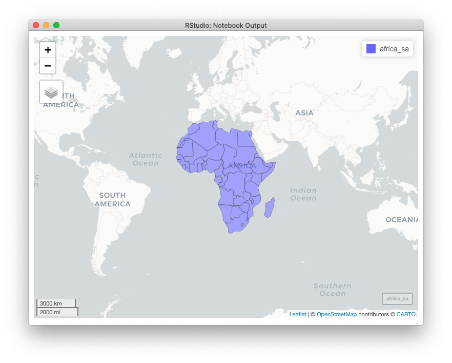
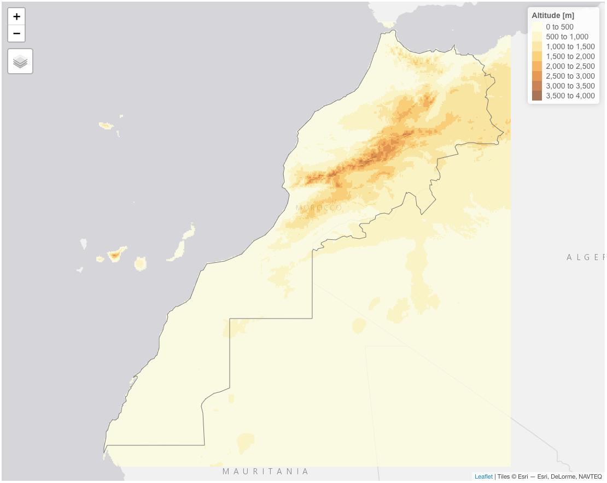
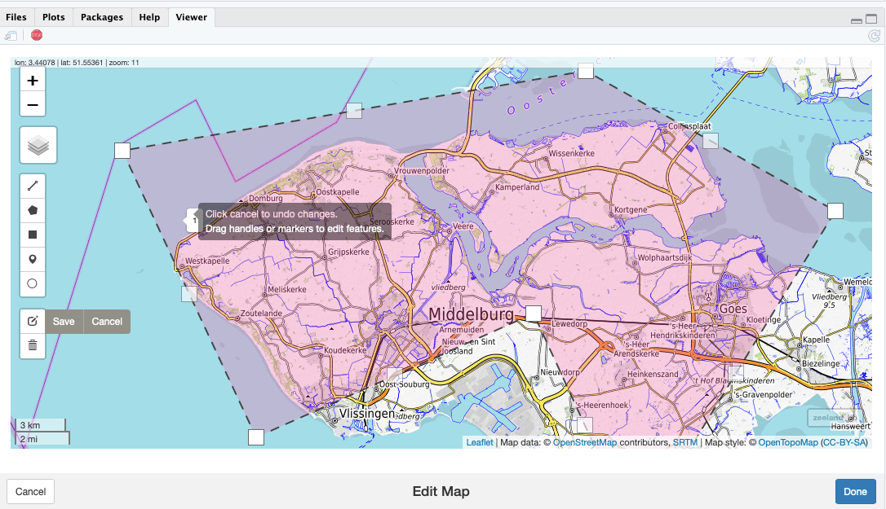

# Statistiques spatiales {#spatial}

```{r setup, results='hide', warning=FALSE, include=FALSE}
SciViews::R
```

Les statistiques spatiales, également en connexion avec les systèmes d'information géographique (SIG), représentent un très large sujet. Il intéresse potentiellement tout biologiste qui travaille avec des données spatialisées, qu'elles soient à 2, 3 ou 4 dimensions (écologie, environnement, épidémiologie, dynamique des populations, biodiversité, etc.) Il est impossible de l'aborder de manière exhaustive en un seul module. Il s'agit donc ici d'une première approche qui vise à vous montrer que R aussi peut être utile dans ce domaine. Voyez les liens dans les sections "pour en savoir plus", si vous voulez approfondir ce sujet.

##### Objectifs {-}

- Être capable de construire une carte dans R et d'y ajouter des éléments tels des points, des formes, des colorations spécifiques en fonction d'une variable quantitative ou qualitative

- Comprendre les principaux systèmes de coordonnées

- S'initier à l'interpolation spatiale

##### Prérequis {-}

Ce module fait suite aux modules 4 et 5 consacrés aux séries spatio-temporelles. Diverses notions, comme l'autocorrélation, sont également utiles ici. Assurez-vous d'avoir bien compris la matière des modules 4 et 5 avant d'aborder celui-ci. De plus, la section concernant la cartographie fait appel aux graphiques dans R qui constituent les modules 2 à 4 du cours SDD I.

## Réalisation de cartes

Les cartes sont des outils de présentation très utiles dès lors que les données à représenter sont liées à des coordonnées géographiques. Des logiciels spécialisés dans le traitement de ce type de données et dans la réalisation de cartes existent\ : ce sont les logiciels de SIG (Systèmes d'Information Géographique, ou GIS en anglais). Le plus connu est sans aucun doute [ArcGIS](https://www.esri.com/en-us/arcgis/about-arcgis/overview). Des alternatives Open source existent comme [GRASS](https://grass.osgeo.org) ou [QGIS](https://www.qgis.org/en/site/). Ces outils sont assez complexes et requièrent une formation minimale non négligeable pour pouvoir les utiliser.

Une alternative simple est de réaliser des cartes directement dans R. L'avantage de réaliser une carte avec R est de pouvoir associer des représentations graphiques avec les outils d'analyses statistiques. Il s'agit, à la fois, d'une option viable pour l'utilisateur occasionnel, et un choix qui se justifie dans des contextes où la carte n'est pas le seul élément important du projet (carte à intégrer dans un document R Markdown, ou à inclure dans un contenu dynamique tel un "dashboard" écrit en R et [Shiny](https://shiny.rstudio.com), par exemple). A titre d'exemple, vous pouvez explorer ces deux applications\ : [COVID-16 tracker](https://vac-lshtm.shinyapps.io/ncov_tracker/?_ga=2.222275100.56067852.1608025707-917889845.1607892304) et [ZIP explorer](https://shiny.rstudio.com/gallery/superzip-example.html) qui vous montrent que la cartographie et la gestion de données spatialisées dans R est parfaitement réalisable avec un résultat très professionnel.

Il existe de très nombreux packages dans R pour réaliser des cartes, cependant, {sf} est un package relativement récent (2017) dont l'objectif est de regrouper et optimiser les fonctionnalités qui sont proposées dans divers packages plus anciens tels que {sp}, {rgdal} et {rgeos}. Nous utiliserons donc ici principalement {sf}, combiné aux fonctionnalités de cartographie de {ggplot2} par l'intermédiaire de notre fonction habituelle de création de graphiques `chart()`.

D'autres packages seront nécessaires, notamment ceux qui contiennent des fonds de cartes comme {tmap}. Dans R, il existe de nombreux objets différents pour représenter des données spatialisées. {sf} propose donc toute une série de fonction pour les convertir en objets **sf** que nous privilégierons ici. Ainsi, pour avoir une carte du monde, nous pourrons fire ceci\ :

```{r}
library(sf)
# Fond de carte mondial de {tmap} converti en objet sf
world <- st_as_sf(read("World", package = "tmap"))
class(world)
```


Un objet **sf** est tout simplement un tableau de données classiques de type cas par variables que vous avez l'habitude de manipuler, mais qui contient une colonne décrivant la zone géographique concernée. Dans notre objet world, la colonne `geometry` décrit des polygones grâce au type **sfc_MULTIPOLYGON**. Le type de la variable `geometry` varie en fonction des coordonnées géographiques avec par exemple sfc_point, sfc_linestring ou encore sfc_polygon.


```{r}
world
```

##### A vous de jouer ! {-}

`r h5p(57, height = 270, toc = "Objet sf")`

Nous voyons qu'outre les frontières des pays dans la variable `geometry`, {tmap} nous renvoie aussi une série d'autres données utiles, comme la superficie de chaque pays dans `area` (utile pour rapporter des observations par unité de surface, par exemple). De votre côté, vous pourrez donc combiner également vos données avec leur localisation dans un tableau **sf**.

De plus, les objets **sf** sont compatibles avec les fonctions de manipulation de tableaux de données qui sont familières pour vous comme `select()`, `filter()`, `*_join()`,...

```{r}
# Tableau réduit en éliminant des colonnes superflues
world %>.%
  select(., name, area, pop_est, economy, geometry) -> world2

head(world2)
```

Pour réaliser une carte, nous utiliserons `chart()` comme d'habitude, mais en ne lui indiquant aucune "esthétique" à utiliser à l'aide de formule. Les "aesthetics" dans {ggplot2} sont les variables utilisées pour construire le graphique. Ensuite, nous utiliserons `geom_sf()` qui sait où trouver les polygones à utiliser pour créer le fond de carte.

Malheureusement, la version de `chart()` dans la SciViews Box 2020 ne supporte pas encore les objets **sf**. Le code suivant remédie à cette lacune (ajoutez ce code dans chacun de vos documents avant d'utiliser `chart()` pour faire des cartes). Il sera naturellement intégré dans la prochaine version du package {chart} et donc, dans la prochaine SciViews Box.

```{r}
SciViews::R
chart.sf <- function(data, specif = aes(), formula = NULL, mapping = aes(), type = NULL, theme = theme_svmap, env = parent.frame()) {
  if (!missing(specif))
    if (inherits(specif, "formula")) {
      formula <- specif
    } else if (inherits(specif, "uneval")) {
      mapping <- specif
    } else rlang::abort("'specif' must be either a formula or aes()/f_aes()")
  if (!is.null(formula)) {
    args <- chart:::as_list(match.call())[-1]
    args$data <- NULL
    args$specif <- NULL
    args$formula <- NULL
    args$mapping <- NULL
    args$type <- NULL
    args$auto.labs <- NULL
    args$env <- NULL
    mapping <- chart:::.rename_aes(chart:::.f_to_aes(formula, args, with.facets = TRUE))
    # Special case ~0
    if (is.numeric(mapping$x) && mapping$x == 0)
      mapping$x <- NULL
  }
  facets <- mapping$facets
  mapping$facets <- NULL
  p <- ggplot(data = data, mapping = mapping, environment = env) +
    theme()
  if (!is_null(facets)) {
    if (is_null(rlang::f_lhs(facets))) {
      p <- p + facet_wrap(facets)
    } else {
      p <- p + facet_grid(facets)
    }
  }
  if (inherits(p, "ggplot")) 
    class(p) <- unique(c("Chart", class(p)))
  p
}
```

Ensuite, réaliser une carte du monde est enfantin\ :

```{r}
chart(data = world) +
  geom_sf()
```

Si nous ne voulons pas le fond grisé, ni les méridens, nous pouvons utiliser le thème `ggsn::blank()`. Nous verrons plus loin que le package {ggsn} permet d'autres annotations pour orienter et indiquer l'échelle sur la carte ensuite.

```{r}
chart(data = world) +
  geom_sf() +
  ggsn::blank()
```

##### A vous de jouer ! {-}

`r h5p(58, height = 270, toc = "But du package ggsn")`

Là où cela devient intéressant, c'est que nous avons la possibilité d'utiliser les autres variables contenues dans le tableau **sf** pour annoter la carte. Par exemple, nous pouvons remplir les polygones (`%fill=%`) représentant les différents pays à l'aide d'une couleur en fonction de la variable `economy`. Une petite astuce toutefois\ : une formule doit obligatoirement contenir une variable `x` après le tilde. Or ici, nous ne voulons fournir que `fill`, mais ni `x`, ni `y` dans la formule. Pour cela, nous indiquons `~ 0` qui sera compris par `chart()` comme aucun `x` et aucun `y`. Ensuite, nous pourrons rajouter toutes les autres esthétiques comprises par {ggplot2} à la suite dans la formule sous la forme `%aes=% variable`, donc ici, `%fill=% economy`.


```{r}
chart(data = world, ~0 %fill=% economy) +
  geom_sf()
```

##### A vous de jouer ! {-}

`r h5p(59, height = 270, toc = "Syntaxe de chart")`

Pour présenter de l'information sur une carte, nous aurons donc besoin d'une ou plusieurs variables qualitatives ou quantitatives associées à des coordonnées spatiales. Les données et les coordonnées spatiales seront, en pratique, souvent dans deux tableaux différents. Vous aurez donc à les combiner en un tableau unique **sf** avant de pouvoir réaliser la carte voulue.

Dans la suite de cette partie, nous verrons successivement comment ajouter et échelle et orienter une carte, comment importer des données géographiques et des fonds de cartes, et ce que sont les CRS ou systèmes de coordonnées géodésiques. Ces éléments sont indispensables pour tracer sa carte correctement. Dans la partie suivante, nous nous attaquerons à la partie plus intéressante qui concerne l'annotation de vos cartes.

### Échelle et orientation

Toute carte qui se respecte contient deux éléments importants\ : une orientation de la carte via l'indication du nord géographique, et une échelle qui permet d'avoir une idée des distances. Nous allons ajouter ces éléments à notre carte du monde grâce au package [{ggsn}](http://oswaldosantos.github.io/ggsn/).

La fonction `ggsn::north()` oriente le nord sur la carte, tandis que `ggsn::scalebar()` ajoute une barre d'échelle. Ces deux fonctions prennent comme premier argument, le jeu de données utilisé. Pour `ggsn::scalebar()` il faut aussi indiquer pas mal de choses pour paramétrer l'échelle, en particulier, la distance et l'unité. Cela demande quelques essais et erreurs avant d'avoir une barre d'échelle correcte. Par exemple pour l'Italie, cela donne\ :

```{r}
world %>.%
  filter(., name == "Italy") %>.%
  chart(data = .) +
    geom_sf() +
    ggsn::north(., location = "topright", symbol = 3) +
    ggsn::scalebar(., dist = 150, dist_unit = "km", location = "bottomleft",
      transform = FALSE, height = 0.015,
      st.dist = 0.02, st.size = 3, border.size = 0.5)
```

### Importation de "shapefiles"

Les fonds de cartes sont principalement stockés dans des fichiers au format [**shapefile** de ESRI](https://doc.arcgis.com/fr/arcgis-online/reference/shapefiles.htm). Comme nous l'avons déjà vu, certains packages R comme {tmap} en proposent déjà directement intégrés à R mais souvent, vous devrez les importer vous-même. Votre première tâche sera donc de trouver des données spatiales qui correspondent à la zone géographique étudiée. Vous pouvez les trouver dans des sites spécialisés comme\ : 

- [Géoportail des institutions fédérales belges](https://www.geo.be/home?l=fr) pour la Belgique
- [GEODATA sur eurostat](https://ec.europa.eu/eurostat/web/gisco/geodata) pour l'Europe

##### A vous de jouer ! {-}

`r h5p(60, height = 270, toc = "Fonds de cartes")`

La fonction `st_read()` permet de lire ces données dans R. Attention, les fichiers au format **shapefile** (dont l'extension est `.shp`) sont associé à trois autres fichiers indispensables à la réalisation de votre carte (avec les extensions `.shx`, `.dbf` et `.prj`). Si, par exemple, vous avez placé ces fichiers dans le sous-répertoire `data` avec le nom `europe`, vous ferez\ :

```{r, eval=FALSE}
europe_map <- st_read("data/europe.shp")
```

```{block2, type = 'note'}
Les fichiers au format **shapefile** sont souvent assez volumineux. La précision de la carte aura une très grande importance sur la taille du fichier. Le tableau ci-dessous met en avant la différence de la taille du fichier en fonction de l'échelle de la carte des pays d'Europe <https://ec.europa.eu/eurostat/web/gisco/geodata/reference-data/administrative-units-statistical-units/countries#countries20> 

Cartes de l'Europe au format **shapefile** en fonction de l'échelle de la carte.

|Echelle | Taille du fichier  |
|--------------|--------------|
| 1:1 million  |    168 Mo    |
| 1:3 million  |   42.3 Mo    |
| 1:10 million |    9.6 Mo    |
| 1:20 million |    4.5 Mo    |
| 1:60 million |   0.57 Mo    |

```

##### A vous de jouer ! {-}

`r h5p(61, height = 270, toc = "Echelle des cartes")`

### Systèmes de coordonnées

La terre n'est pas plate, vous le savez (elle n'est pas tout à fait ronde non plus). Son axe de rotation n'est pas fixe. La gravité y est variable. Nous devons donc projeter des objets tridimensionnels en deux dimensions sur notre carte. Une projection va inévitablement plus ou moins déformer notre visualisation en deux dimensions. Il existe plusieurs projections différentes avec des caractéristiques particulières (respect des distances, des volumes, etc.). Vous devrez sélectionner et utiliser celle qui convient le mieux à votre carte. 

La fonction `st_crs()` vous renvoie toutes les informations lié au système géodésique (*Coordinate Reference System, CRS*) utilisé. Ces notions sont très complexes et sortent du cadre de ce cours. Nous pouvons néanmoins citer le WGS84 qui est le système utilisé par le GPS que nous connaissons tous. Chaque pays a un système qui lui est propre et qui a évolué au cours du temps. Le tout rend le traitement des données spatiales encore plus complexe.

Afin de clarifier et unifier ces différents systèmes de référence, un code est attribué à chacun d'eux dans le standard **[EPSG](https://epsg.io)**. Par exemple, le EPSG:4326 correspond au système WGS84 cité plus haut et utilisé par les GPS. Lors de la combinaison de différentes données spatiales, il sera indispensable de vous assurer que ces données sont compatible et obtenue via le même CRS. La Belgique a employé et continue d'employer plusieurs systèmes différent. Le site [epsg.io](http://epsg.io/?q=belgium) en recense huit\ ! Nous vous conseillons vivement de lire maintenant [comprendre les CRS](https://medium.com/cr%C3%A9ation-dune-app-cartographique-avec-firebase-vue/comprendre-les-coordinates-reference-system-crs-b67a88bce63c) pour tout savoir ou presque sur ces systèmes de coordonnées. 

La carte du monde présenté précédemment suit les conventions de la norme EPSG:4326, alias WGS84.

```{r}
st_crs(world)
```

##### A vous de jouer ! {-}

`r h5p(62, height = 270, toc = "Standard EPSG")`

Intéressons-nous maintenant à l'Afrique australe définie par l'ONU comme constituée des pays suivants\ : Afrique du Sud, Namibie, Botswana, Lesotho et Swaziland.

```{r}
southern_africa <- c("Botswana", "Lesotho", "Namibia", "South Africa", "Swaziland")
```

Nous commençons avec une carte du continent africain tout entier\ :

```{r}
world %>.%
  filter(., continent == "Africa") %>.%
  mutate(., austral = name %in%  southern_africa) -> africa

chart(data = africa, ~0 %fill=% austral) +
  geom_sf()
```

La fonction qui permet de transformer les coordonnées géographiques d'un CRS à un autre est tout simplement `st_transform()`. Nous pouvons simplement comparer les mêmes données spatiales avec deux CRS différents. Ce premier graphique utile la convention EPSG:4326 présenté précédemment.

Ce second graphique utilise le CRS EPSG:22235 qui est centré sur l'Afrique du Sud. Nous n'avons aucunement changé les données. Il s'agit simplement de deux représentations différentes des *mêmes* données géographiques.

```{r}
africa %>.%
  st_transform(., 22235) -> africa_sa

chart(data = africa_sa, ~0 %fill=% austral) +
  geom_sf()
```

La carte dont le système géodésique est adapté à la zones étudiée est plus intéressante, visuellement parlant et aussi parce que les distances et les surfaces dans cette zone sont mieux respectées. En effet, cette zone est moins déformée par la projection en deux dimensions.

## Annotation de cartes

L'annotation de carte consiste à ajouter des couches d'information par dessus le fond de carte. C'est bien évidemment ces fonctions d'annotation qui font tout l'intérêt des SIG, ainsi que des cartes générées dans R.

### Labels et textes

Afin qu'une carte soit plus compréhensible, nous ajoutons des informations sous la forme de labels avec `geom_sf_label()` ou de texte avec `geom_sf_text()`. Il faut être particulièrement attentif à la taille du texte (contrôlable avec `size=`). Concentrons-nous maintenant sur l'Afrique australe.

```{r}
africa_sa %>.%
  filter(., name %in% southern_africa) -> s_africa_sa
```

Pour les Européens, par exemple, cette zone du monde est difficilement reconnaissable telle quelle. L'ajout du nom des pays est donc une information utile pour la situer.

```{r}
chart(data = s_africa_sa) +
  geom_sf() +
  geom_sf_text(aes(label = name), size = 3) +
  ggsn::north(s_africa_sa)
```

### Couches supplémentaires **sf**

Nous pouvons superposer plusieurs objets **sf** sur une même carte pour rendre l'information sous forme de couches successives. Ces objets **sf** peuvent contenir des polygones comme nous l'avons vu jusqu'ici, mais ils peuvent aussi contenir d'autres objets comme des points caractérisés par leurs coordonnées latitude et longitude.

A titre d'illustration, nous allons ajouter une couche à la carte de l'Afrique du sud qui localise les capitales des différents pays. Les capitales ainsi que leurs latitudes et longitudes en coordonnées degrés décimaux^[Les coordonnées latitude et longitudes sont d'habitude exprimées en degrés minutes secondes. Par contre, sur ordinateur, la forme degrés décimaux est plus pratique. Les fractions de degrés sont représentés sous forme décimale, ce qui fait que la coordonnées peut être stockée dans un objet `numeric` classique (voir [ici](https://support.google.com/maps/answer/18539?co=GENIE.Platform%3DDesktop&hl=fr)). Des [convertisseurs en ligne](https://www.presqu-ile-de-crozon.com/conversion-des-coordonnees-gps.php) existent pour transformer les coordonnées d'un système à l'autre.] des pays d'Afrique australe sont d'abord encodées dans un tableau classique `s_capitals`.

```{r}
s_capitals <- tibble(
  country = c("Botswana", "Lesotho", "Namibia", "South Africa", "Swaziland"),
  capital = c("Gaborone", "Maseru", "Windhoek",     "Pretoria",   "Lobamba"),
  lat     = c(  -24.7356, -29.3906,   -22.6406,       -25.8209,    -26.5431),
  lon     = c(   25.9113,  27.5015,    17.0782,        28.1909,     31.2012)
)
s_capitals
```

Le tableau `s_capitals` doit ensuite être converti en objet **sf** avec `st_as_sf()` que nous avions déjà utilisé plus haut avant de pouvoir être utilisé pour annoter la carte . Nous devons préciser ici quelles variables représentent les coordonnées des points à l'aide de `coords=` et aussi indiquer quel `crs=` nous souhaitons utiliser.

```{r}
(s_capitals_sa <- st_as_sf(s_capitals, coords = c("lon", "lat"), crs = 4326))
```

Nous constatons que la tableau a été transformé. Nos colonnes `lat` et `lon` ont disparu et une colonne `geometry` a été calculée. Cette colonne contient des objets `sfc_POINT` qui représentent comme leur nom le suggère, des points sur la carte. A ce stade, `geom_sf()` est capable d'utiliser l'information contenue dans l'objet **sf** pour annoter la carte.

```{r}
chart(data = s_africa_sa) +
  geom_sf(fill = "white") +
  geom_sf(data = s_capitals_sa) +
  ggsn::north(s_africa_sa, symbol = 3)
```

Et bien sûr, nous pouvons aussi ajouter le nom de ces capitales sur la carte.

```{r}
chart(data = s_africa_sa) +
  geom_sf(fill = "white") +
  geom_sf(data = s_capitals_sa) +
  geom_sf_label(data = s_capitals_sa, aes(label = capital),
    size = 3, fill = "lightgray", hjust = 1, vjust = 0.5) +
  ggsn::north(s_africa_sa, symbol = 3)
```

Notez que, à chaque addition d'une couche sur le graphique à l'aide de l'opérateur `+`, vous êtes libres de redéfinir les données (`data=`), ou des esthétiques tels que `fill=`. Les données et les esthétiques fournies via la formule dans `chart()` constituent des valeurs par défaut utilisées si elles ne sont pas redéfinies explicitement à chaque appel des fonctions `geom_xxx()`. Donc ici nous utilisons deux fois `geom_sf()` successivement, mais l'effet est très différent car pour la première, nous utilisons les données par défaut définies dans `chart()` (`s_africa_sa`), alors qu'au second appel, nous redéfinissons les données comme étant `s_capitals_sa`. De même, pour `geom_sf_label()` nous sommes obligés de repréciser `data = s_capitals_sa` sinon la fonction utilise à nouveau les données par défaut `s_africa_sa`. Vous imaginez aisément l'immense flexibilité que ce système autorise, en particulier pour la superposition de couches d'information complémentaires via divers objets **sf** sur vos cartes.

### Variables supplémentaires

La coloration de zones d'intérêts est très utilisé en cartographie afin de faire ressortir de l'information. C'est très facile à faire avec R. Il suffit d'avoir ajouté des variables supplémentaires dans notre tableau **sf** et de les utiliser pour le remplissage ou la couleur du trait des polygones. On va utiliser cette méthode pour comparer des zones entre elles. Le graphique ci-dessous compare les densités de population en fonction des pays du continent africain. Il faut donc associer à chaque zone une valeur soit qualitative, soit quantitative. Nous pouvons, par exemple, observer que le pays le plus peuplé est le Nigeria si nous colorons les pays par la variable quantitative `pop_est`. 

```{r}
chart(data = africa_sa, ~ 0 %fill=% pop_est) +
  geom_sf()
```

Dans la version précédente, nous indiquions tous les esthétiques directement dans la formule fournie à `chart()`. Mais nous pouvons également les fournir individuellement à chaque appel de `geom_sf()`. Il faut alors les fournir via `aes()`. Cette méthode est même beaucoup plus compréhensible lorsque nous allons superposer différentes couches sur la carte. Ainsi, le code suivant donne exactement le même résultat.

```{r}
chart(data = africa_sa) +
  geom_sf(aes(fill = pop_est))
```

Nous pouvons naturellement aussi utiliser des variables qualitatives pour colorer nos polygones. Si nous nous intéressons au niveau de développement économique des pays africains, nous utiliserons la variable `economy` à sept modalités. 

```{r}
levels(africa_sa$economy)
```

Sur la carte suivante, nous observons que l'Afrique du Sud, le Zimbabwe, le Kenya, le Nigeria et l'Egypte sont les pays les plus développés du continent africain. Notez que nous avons changé l'échelle de couleur à l'aide de `scale_fill_viridis_d()` ici.

```{r}
chart(data = africa_sa) +
  geom_sf(aes(fill = economy)) +
  scale_fill_viridis_d()
```

## Les couches "raster"

Jusqu'ici, nous avons travaillé exclusivement avec des **données vectorielles**, c'est-à-dire, des données représentées par des points, des traits, des polygones dont les sommets sont définis par des positions géographiques. Tous ces objets sont matérialisés en R sous forme **sf** et nous avons vu que `geom_sf()` permet de manipuler tout cela pratiquement comme d'habitude à l'aide de `chart()` et le moteur graphique {ggplot2}. Toutefois, il y a une autre catégorie de données que sont les **raster**s. Il s'agit ici de données (numériques la plupart du temps) présentées sur une grille rectangulaire. Le principe est le même que pour les images numériques. La scène est découpée en petits carrés appelés pixels et une valeur est associée à chaque pixel.


Les couches "raster" sont utilisées pour représenter par exemple des **modèles terrain** reprenant l'élévation du sol, des images satellitaires, ou toute autre caractéristique mesurée ou calculée sur une grille rectangulaire dense. Nous allons illustrer cela en utilisant un raster de type modèle terrain et en *calculant* un autre (pluviométrie sur un pays) dans la suite de ce module.

### Modèle terrain du Maroc

Le Maroc présente un relief contrasté avec, au nord-ouest, la chaîne montagneuse de l'Atlas, et au sud, le désert du Sahara. Le modèle terrain avec une grille carré d'un kilomètre environ de côté est disponible dans le package {aurelhy}. Cependant, malheureusement, ce package n'est **pas** installé par défaut dans la SciViews Box. Nous devons donc l'installer avec l'instruction suivante (à ne faire qu'une seule fois)\ :

```{r, eval=FALSE}
remotes::install_github("phgrosjean/aurelhy", upgrade = "never")
```

De plus, les données dans {aurelhy} sont dans un format propriétaire et aucune fonction de conversion en **raster** ou **sf** n'y est proposée. Nous allons donc utiliser nos propres fonctions de conversion ici (elles seront intégrées dans la prochaine version du package). Il n'est pas utile de comprendre le contenu de ce code en première lecture.

```{r}
# Transformation de geomat, geotm & geomask en raster
st_as_raster <- function(x, ...)
  UseMethod("st_as_raster")
st_as_raster.geomat <- function(x, crs = "+proj=longlat +datum=WGS84", ...) {
  x_coords <- aurelhy::coords(x)
  raster::raster(t(unclass(x))[ncol(x):1, ],
  xmn = x_coords["x1"], xmx = x_coords["x2"],
  ymn = x_coords["y1"], ymx = x_coords["y2"],
  crs = crs)
}

# Transformation de geoshapes en sf, sfc_MULTIPOLYGONS
library(sf)
st_as_sf.geoshapes <- function(x, name = "P1", crs = "+proj=longlat +datum=WGS84", ...) {
  points <- st_as_sf(dplyr::bind_rows(x, .id = "id"),
    coords = c("x", "y"))
  polygons <- st_sf(aggregate(points$geometry, list(points$id),
    function(g) st_cast(st_combine(g), "POLYGON")))
  st_crs(polygons) <- crs
  st_as_sf(tibble::tibble(name = name,
    geometry = st_combine(polygons)))
}

# Transformation de geopoints en sf, sfc_POINTS
st_as_sf.geopoints <- function(x, crs = "+proj=longlat +datum=WGS84", ...) {
  class(x) <- "data.frame"
  x_sf <- st_as_sf(x, coords = c("x", "y"))
  st_crs(x_sf) <- crs
  x_sf
}
```

<!--
CECI CORRESPOND A UN ESSAI INFRUCTUEUX DE CONVERSION EN **stars**
Je le garde pour mémoire...

L'objet `morocco` est un `geomat` propre à {aurelhy} (voir `?geomat`). C'est un objet très simple constitué d'une matrice représentant l'élévation du terrain en mètres sur une grille carrée avec un attribut `coords` qui contient `size`, la largeur d'une maille de la grille, et `x`et `y`, les latitudes et longitudes du point supérieur gauche de la grille toutes trois exprimées en degrés décimaux selon le système CRS WGS 84. Les objets **sf** ne peuvent contenir que des données vectorielles. Pour ce type de données nous devons utiliser les objects **stars** du package {stars}. Pour la conversion, devons créer une grille curviléaire car les coordonnées sont en latitude et longitude, et ensuite indiquer le type ce CRS qui est utilisé ici\ :

```r
library(stars)
# Dimensions must be named x and y
names(dim(morocco)) <- c("x", "y")
m_coords <- coords(morocco)
m_rows <- dim(morocco)["x"]
m_cols <- dim(morocco)["y"]
m_size <- m_coords["size"]
# Matrices of lat and long for the centers of each grid pixel
m_x <- m_coords["x"] + ((1:m_rows) - 0.5) * m_size
mat_x <- matrix(m_x, nrow = m_rows, ncol = m_cols, byrow = TRUE)
names(dim(mat_x)) <- c("x", "y")
m_y <- m_coords["y"] + ((1:m_cols) - 0.5) * m_size
mat_y <- matrix(m_y, nrow = m_rows, ncol = m_cols, byrow = FALSE)
names(dim(mat_y)) <- c("x", "y")
tm <- st_as_stars(morocco)
# Convert into long & lat grid with WGS84 CRS
tm <- st_as_stars(tm, curvilinear = list(x = mat_x, y = mat_y))
# Add the CRS in use (WGS84 with lat & long positions for the grid)
st_crs(tm) <- "+proj=longlat +ellps=WGS84 +no_defs"
tm
```
-->

<!--
Nous allons maintenant combiner ce modèle terrain avec une couche indiquant les frontières du Maroc.

```r
library(tmap)
library(spData)
library(sf)
world <- st_as_sf(read("world", package = "spData"))
class(world)
mor_bord <- filter(world, name_long == "Morocco")
```

```r
map_mor <- tm_shape(mor_bord) + tm_polygons()
map_mor
```

Carte avec élévations et frontières.

```r
map_mor + tm_shape(mor_ras) + tm_raster(alpha = 0.7)
```

Nous voyons bien que ces frontières ne sont pas assez détaillées. Nous utilisons des données plus précises.
-->

A présent, nous allons récupérer les données raster du modèle terrain à partir de `morocco` et les données vectorielles des frontière du Maroc à partir de `mbord`, et nous les convertissons en **raster** et **sf**, respectivement.

```{r}
library(raster)
library(sf)
data("morocco", package = "aurelhy")
m_tm <- st_as_raster(morocco)
data("mbord", package = "aurelhy")
mbord[[1]] <- mbord[[1]][-(1:28), ] # Données inutiles au début à éliminer
m_bord <- st_as_sf(mbord, name = "Morocco")
```

Vérifions tout d'abord que les frontières (vectorielles) du Maroc ont été converties correctement\ :

```{r}
chart(data = m_bord) +
  geom_sf()
```

Maintenant, notre ojet `m_tm`.

```{r}
class(m_tm)
length(m_tm)
res(m_tm)
m_tm
```

Notre objet est précisément un **rasterLayer** (une couche raster). Il contient plus de 3,7 millions de pixels. La résolution d'un pixel (carré) est d'environ 0.008° en latitude comme en longitude. Cela représente environ 924km à cet endroit de la terre. Les valeurs vont de 1m à 4057m.

```{block2, type = 'note'}
La plupart des rasters que vous importerez proviendront de logiciels GIS et seront enregistrés soit en une forme particulière d'image TIFF appelée GeoTIFF avec extension `.tif`, soit au format NetCDF avec extenstion `.nc`. Il suffit d'utiliser `raster("filename")` pour lire ces données et les inclure dans un objet **rasterLayer** en une seule étape. L'objet supporte également des rasters tellement volumineux qu'ils ne tiennent pas entièrement en mémoire\ !

Pour exporter vos rasters, vous utiliserez la fonction `writeRaster()`. Elle supporte de nombreux formats différents dont les deux cités ci-dessus, voir `?writeFormats`.
```

Un raster de plusieurs millions de points n'est pas inhabituel. Cependant pour représenter l'élévation du sol sur tout le territoire marocain sur une carte à basse ou moyenne résolution, nous n'avons pas forcément besoin d'autant d'information. Nous pouvons utiliser `aggregate()` pour réduire cette résolution. Nous allons la diviser par cinq. Mais comme cela se fait dans les deux dimensions, l'objet sera 5 * 5 = 25 fois plus petit\ !

```{r}
m_tm2 <- aggregate(m_tm, fact = 5)
length(m_tm2)
res(m_tm2)
```

Notre objet `m_tm2`ne contient plus qu'environ 150.000 pixels. Il existe de nombreuses façons de représenter visuellement cet objet sur une carte dans R, mais si nous suivons l'approche choisie jusqu'ici d'utiliser `chart()` et `geom_sf()` avec des objets vectoriels **sf**, nous devons le convertir en un objet compatible pour pouvoir le rajouter comme couche supplémentaire. C'est possible en passant par un autre objet appelé **stars** avec `st_as_stars()` et en utilisant `geom_stars(, sf = TRUE)`... mais déjà ici, ce n'est plus très simple à manipuler. Voici comment cela serait fait (mais le graphique n'est **pas** généré... explications juste en dessous)...

```{r, eval=FALSE}
library(stars)
chart(data = m_bord) +
  # Conversion en starts et ajoute comme couche 'sf-compatible'
  geom_stars(data = st_as_stars(m_tm2), sf = TRUE) +
  # Tracé des frontières du pays
  geom_sf()
```

Si vous exécutez ce code, vous vous rendrez compte qu'il faut un temps **énorme** (plusieurs dizaines de minutes sur un PC puissant et doté de beaucoup de mémoire vive) pour réaliser ce graphique. En fait, notre raster est converti en un objet vectoriel constitué d'autant de petits polygones colorés qu'il y a de pixels dans le raster. Cela prend énormément de temps à calculer, et ensuite à tracer sur le graphique.

**Clairement, la combinaison de rasters avec sf sur des graphiques {ggplot2}, si elle est techniquement possible, doit être strictement limitée à des rasters de très basse résolution. Dans la section suivante, nous découvrirons un moteur de cartographie dans R qui ne présente pas ces limitations et qui reste assez semblable à {ggplot2} du point de vue de son interface\ : {tmap}.

## Cartes avec {tmap} et autres

De nombreux packages R permettent de réaliser des cartes. Nous avons utilisé jusqu'à présent {ggplot2} pour visualiser nos objets **sf**. Mais d'autres moteurs graphiques peuvent aussi être employés pour générer des cartes statique ou dynamiques et interactives.

### Graphiques de base R

Le package {sf} associé à des instructions en R de base permet de réaliser des cartes. Le R de base à l'avantage d'être très rapide dans son exécution. Le package [{cartography}](http://riatelab.github.io/cartography/docs/) permet d'améliorer ces graphiques comme avec la fonction `layoutLayer()` pour ajouter un titre, une orientation ou encore une légende. Malheureusement, son interface (les fonctions et leurs arguments à utiliser) est totalement différente de {ggplot2}, de même que le rendu final. Nous en parlons car il s'agit tout de même d'une solution efficace pour réaliser des cartes professionnelles dans R. Voici donc, de manière illustrative, une carte réalisée avec ce package.

```{r}
library(cartography)
plot(st_geometry(africa_sa),
  col = "grey", border = "grey3", bg = "lightblue1")
plot(st_geometry(s_africa_sa),
  add = TRUE, cex = 1.2, col = "darkseagreen3", pch = 20)
layoutLayer(title = "Afrique", tabtitle = TRUE, north = TRUE, 
  frame = TRUE, posscale = "bottomleft", scale = 1000)
```

### Utilisation de {tmap}

Le package [{tmap}](https://mtennekes.github.io/tmap/index.html) est un package dédié à la représentation cartographique dont la syntaxe va se rapprocher de celle de {ggplot2} (utilisé avec `chart()`). En effet, il superpose des couches sur le graphique en utilisant l'opérateur `+` comme vous avez l'habitude de faire jusqu'ici pour vos graphiques en R. Mais il est beaucoup plus rapide que {ggplot2} et permet de combiner à souhait des couches vectorielles et raster. Il comprend également une série de fonctions de personnalisation de cartes très intéressantes.

Si nous reprenons notre carte du continent africain, cela donnera ceci en {tmap}\ : `tm_shape()` lis les données d'un objet **raster** ou **sf** et les fonctions suivantes telles que `tm_polygons` ou `tm_borders()` vont jouer le même effet que `geom_xxx()` dans {ggplot2} en matérialisant ces données sous une forme particulière (ici un polygone) sur la carte. Des fonctions comme `tm_compass()` ou `tm_scale_bar()` vont orienter la carte et lui ajouter une échelle. Enfin, `tm_layout()` propose de nombreux paramètres pour changer l'apparence de la carte et sont l'équivalent des fonctions `theme_xxx()` de {ggplot2}.

```{r}
library(tmap)
tm_shape(africa_sa) +
  tm_borders() +
  # Mise en évidence de l'Afrique Australe
  tm_fill("austral", legend.show = FALSE) + 
  tm_compass(position = c("right", "top")) + # Ajout de l'orientation
  tm_scale_bar(position = c("left", "bottom")) + # Ajout de l'échelle
  tm_layout(bg.color = "skyblue") # Ajout d'un fond bleu
```

Les avantages de {tmap} apparaissent clairement lorsqu'une couche raster est ajoutée au graphique. Reprenons notre carte du relief marocain que nous avions été incapable de réaliser en un temps raisonnable avec {ggplot2} sous forme entièrement convertie en objets vectoriels **sf**. Et bien avec {tmap} cette carte se réalise le plus naturellement du monde.

Nous allons d'abord effectuer une carte des frontière uniquement. Nous ne sommes pas obligés de le faire, mais nous pouvons assigner une carte à un objet R. Dans ce cas, la carte n'est affiché que si l'objet est imprimé.

```{r}
library(tmap)
m_map <- tm_shape(m_bord) + tm_borders()
```

La carte est construite, mais rien ne s'affiche. C'est exactement comme avec {ggplot2}. Pour afficher la carte, nous faisons (notez au passage que la frontière avec l'Algérie fluctue légèrement d'une carte à l'autre et au cours du temps)\ :

```{r}
m_map
```

Toujours comme {ggplot2}, le plus intéressant, c'est que nous pouvons partir de cet objet `m_map` et lui rajouter des couches par après. Ajoutons notre raster modèle terrain moyenne résolution `m_tm2` avec `tm_shape()` et matérialisons-le sur la carte avec `tm_raster()`\ :

```{r}
m_map2 <- m_map +
  tm_shape(m_tm2) +
  tm_raster(n = 8, alpha = 0.7, , title = "Altitude [m]") +
  tm_layout(legend.position = c("left", "top"))
m_map2
```

Vous noterez à l'usage que les couches rasters ajoutées à {tmap} sont raisonnablement rapide, et en tous cas bien plus utilisables que dans {ggplot2}. Les arguments à `tm_raster()` sont assez clairs. Le nombre de niveaux de couleurs est donné (ou plutôt suggéré, car la meilleure distribution possible des couches sera calculée automatiquement) par `n=`, `alpha=` est la transparence permettant de voir la couche de la frontière par dessous et `title=` est le titre de la légende. Cette légende peut être (re)positionnée avec `tm_layout()`.

Vous ne l'avez sans doute pas remarqué, mais il y a ici une différente importante avec {ggplot2}. Dans le graphique {ggplot2}, les esthétiques définies dans `ggplot()` ou `chart()` *restent* les valeurs par défaut jusqu'au bout. Avec {tmap}, chaque appel de `tm_shape()` *remplace* les données précédentes entièrement. Ainsi, `tm_raster()` se rapporte automatiquement `m_tm2` et non pas à `m_bord` qui n'est d'ailleurs plus accessible.

Nous vous laissons comme exercice l'annotation de cette carte avec orientation, échelle et (vous devrez chercher un peu), libellé des axes en latitude et longitude.

### Cartes interactives

La librairie JavaScript [leaflet](https://leafletjs.com) est l'une des plus utilisées pour générer des cartes interactives dans un browser web. [OpenStreetMap](https://www.openstreetmap.org) sert de fond de carte ici. Le package R du même nom permet d'utiliser cette librairie dans R et Rstudio. Le package {mapview} offre une surcouche pour faciliter la création de ces cartes interactives, y compris dans des documents R Markdown. C'est très utile pour visualiser ce que contient un objet **sf**.

```{r, eval=FALSE}
SciViews::R
library(sf)
read("World", package = "tmap") %>.%
  st_as_sf(.) %>.%
  filter(., continent == "Africa") %>.%
  mapview::mapview(.)
```

A cause d'un bug dans {leaflet} la carte interactive que l'on obtient ici ne s'affiche pas dans un bookdown. Par contre, si ce code est exécuté dans RStudio (copiez-collez ce code dans la console R dans RStudio), la carte apparaîtra dans l'onglet "Viewer", et vous pourrez utiliser le bouton "Zoom" pour voir cette carte dans une fenêtre agrandie. Il est alors possible de zoomer/dézoomer (boutons + et -), changer de fond de carte (boutons juste en dessous) et visualiser les informations annexes de l'objet **sf** en cliquant sur un pays. Les fonctions de {leaflet} permettent de faire encore plus de choses, voyez [sa documentation](https://rstudio.github.io/leaflet/). C'est un outil fantastique pour explorer de manière interactive des données spatialisées\ !



Le package {tmap} propose également de convertir ses cartes en carte interactive avec {leaflet}. C'est la fonction `tmpa_mode()` qui permet de décider si la carte est figée si on indique `"plot"` ou interactive si on indique `"view"`.

```{r, eval=FALSE}
tmap_mode("view")
m_map2
# Ne pas oublier de repasser dans l'autre mode, sinon toutes les cartes
# suivantes seront interactives !
tmap_mode("plot")
```

Pour la même raison (bug), ce code n'est pas exécuté ici, mais s'il l'était, vous auriez la carte interactive ci-dessous.



### Edition interactive

Le package {mapedit} propose des fonctions qui permettent d'éditer et de créer des objets **sf**. L'exemple suivant trace un polygone sur la Zélande (province du sud des Pays-Bas) et vous permet de l'éditer et de le sauver. Exécutez ce code dans RStudio pour voir de quoi il s'agit exactement (`tmaptools::bb()` crée  une boite encadrant une zone, que vous pouvez éditer à la souris grâce à `editMap()`).

```{r, eval=FALSE}
library(mapedit)
library(mapview)
# Toutes les provinces des Pays-Bas
data("NLD_prov", package = "tmap")
# Zélande seulement
zeeland <- NLD_prov[10, ]
# Boite encadrant la Zélande comme point de départ d'un polygone
zeeland_bb <- tmaptools::bb(zeeland)
# Carte interactive permettant d'éditer ce polygone
 editMap(mapview(zeeland_bb), targetLayerId = "zeeland_bb")
```

Les boutons à gauche permettent d'éditer des polygones existants ou d'en créer de nouveaux au dessus du fond de carte. Les modifications sont sauvegardées automatiquement quand vous cliquez sur le bouton **Done** bleu en bas à droite.



##### A vous de jouer ! {-}

`r learnr("C06La_map", title = "Réalisation de cartes avec R", toc = "Réalisation de cartes avec R")`

##### Pour en savoir plus {-}

De nombreuses ressources existent sur le Net pour la cartographie avec R. En voici quelques une intéressantes qui vous permettront d'approfondir cette vaste matière.

- [Cartographie avec R](https://rcarto.github.io/carto_avec_r/) est un bookdown en ligne qui présente la cartographie avec R. De nombreuses techniques complémentaires non abordées dans le cours y sont présentées.

- [Initiation à la cartographie avec {sf} & Co. par Sébastien Rochette](https://statnmap.com/fr/2018-07-14-initiation-a-la-cartographie-avec-sf-et-compagnie/) est un article de blog sur la cartographie dans R. Il a rédigé plusieurs article sur le sujet.

- [Visualiser des cartes interactives avec {leaflet}](https://thinkr.fr/cartographie-interactive-comment-visualiser-mes-donnees-spatiales-de-maniere-dynamique-avec-leaflet/) présente quelques types de cartes interactives qui sont réalisable avec {leaflet}.

- Site web du [package sf](https://r-spatial.github.io/sf/index.html). Documentation officielle (en anglais).

- Le [chapitre 6] de "ggplot2: elegant graphics for data analysis" est exclusivement consacré à la réalisation de cartes avec `ggplot()` (en anglais). vous pouvez sans problèmes lui substituer `chart()` et utiliser pour le reste le code présenté ici.

- Introduction rapide à [tmap](https://cran.r-project.org/web/packages/tmap/vignettes/tmap-getstarted.html), en anglais.

- [Article originel](https://www.jstatsoft.org/article/view/v084i06) décrivant {tmap} (en anglais). Vue d'ensemble mais certaines parties ne sont plus d'actualité par rapport à la version actuelle du package.

- Le [chapitre 8](https://geocompr.robinlovelace.net/adv-map.html) de "Geocomputation with R" est entièrement consacré à la réalisation de cartes à l'aide de {tmap} (en anglais).

- Introduction à [{cartography}](https://cran.r-project.org/web/packages/cartography/vignettes/cartography.html), en anglais.

- [Cartographie interactive\ : comment visualiser mes données spatiales de manière dynamique avec {leaflet}](https://thinkr.fr/cartographie-interactive-comment-visualiser-mes-donnees-spatiales-de-maniere-dynamique-avec-leaflet/) est une introduction rapide en français à {leaflet} dans R et Shiny.

## Interpolation spatiale

Parmi les nombreuses techniques statistiques appliquées aux données géoréférencées ([autocorrélation spatiale](https://mgimond.github.io/Spatial/spatial-autocorrelation.html), [analyse de motifs de points](https://mgimond.github.io/Spatial/chp11-0.html), [modélisation spatiale et spatio-temporelle](https://www.paulamoraga.com/book-geospatial/sec-arealdataexamplespatial.html), [classification et segmentation de zones géographiques](https://www.r-bloggers.com/2020/03/analyzing-remote-sensing-data-using-image-segmentation/), ...) nous nous attarderons sur l'une des plus utiles\ : l'[**interpolation spatiale**](https://mgimond.github.io/Spatial/spatial-interpolation.html). Son principe consiste à interpoler la variation d'une mesure quantitative dans une zone géographique donnée à partir de mesures éparses. Cette interpolation spatiale permet de construire ensuite des cartes bien plus percutantes.

Il est en effet plutôt rare d'avoir une couverture dense de mesures sur une grande étendue géographique. Si nous prenons l'exemple de données météorologiques, mis à part l'utilisation d'image satellites, les données sont la plupart du temps obtenue à partir d'un réseau de station météorologiques plus ou moins dense. Dans notre exemple, nous nous intéresserons à la **pluviométrie** exprimée en mm d'eau par an. Un pluviomètre est un appareil simple qui recueille l'eau tombée du ciel sur une surface donnée et qui contient un tube gradué en mm. Il suffit alors de lire la valeur après un laps de temps donné pour connaître la quantité cumulée d'eau qui est tombée du ciel. 

, CC-BY-SA.](images/06-spatial/pluviometre.jpg)

##### A vous de jouer ! {-}

`r h5p(63, height = 270, toc = "Interpolation spatiale")`

### Où pleut-il au Maroc\ ?

Les données que nous allons traiter comme exemple ne sont pas dénuées d'intérêt pour le botaniste, le zoologiste, ou encore, l'éco-conseiller, qui ont tous besoin de données environnementales pour comprendre la distributions des plantes et des animaux. Bein sûr, la technique est également utilisable dans bien d'autres contextes (distrubtion des espèces et biodiversité, gradiens de pollution, progression d'une épidémie, etc.)

Sur base de nos données relative au Maroc que nous avons utilisées comme exemple jusqu'ici, nous avons également `mrain` qui propose des mesures de pluviométrie em mm/an enregistrées à une quarantaine de stations météorologiques réparties sur tout le territoire, mais de manière inégale. Cet objet **geopoints** doit être converti en **sf** comme à notre habitude.

```{r}
data("mrain", package = "aurelhy")
m_rain <- st_as_sf(mrain, coords = c("x", "y"))
m_rain
```

Nous pouvons rajouter ces données de pluviométrie sur notre carte du Maroc avec {tmap}. Si nous utilisons `tm_dots()`, nous localisons simplement les stations météorologiques pour lesquelles nous avons des données de pluviométrie annuelle\ :

```{r}
m_map2 + 
  tm_shape(m_rain) +
  tm_dots(col = "red", size = 0.05)
```

Plus intéressant, avec `tm_bubbles()` nous visualisons également l'intensité des pluies à l'aide du diamètre des cercles\ :

```{r}
m_map3 <- m_map2 + 
  tm_shape(m_rain) +
  tm_bubbles(col = "darkblue", size = "rain",
    legend.size.is.portrait = TRUE, title.size = "Pluie [mm/an]")
m_map3
```

Comme nous pouvons le voir, les données sont très éparses. Ce serait pourtant utile d'avoir une couverture de l'estimation de la pluviométrie sur tout le territoire marocain. Pour cela, nous devons utiliser l'**interpolation spatiale** pour créer un raster sur base de ces données.

L'interpolation spatiale est possible parce que, comme pour les séries chronologiques, les données géoréférencées ont généralement une forte autocorrélation. Ainsi, la variation probable de pluviométrie entre deux stations peut, en première approximation, êtrte considérée "dans les mêmes eaux" (si je puis dire) que les valeurs mesurées aux deux stations.

##### A vous de jouer ! {-}

`r h5p(64, height = 270, toc = "Autocorrélation")`

### Interpolation avec DIP

Nous allons utiliser le package [{gstat}](https://r-spatial.github.io/gstat/) pour interpoler la pluviométrie marocaine. Celui-ci propose [plusieurs techniques d'interpolation](http://132.72.155.230:3838/r/spatial-interpolation-of-point-data.html). La méthode de la distance inversée pondérée (DIP, *inverse weighted distance en anglais ou IDW*) est une méthode simple. Elle calcule la moyenne pondérée par l'inverse de la distance entre le point à interpoler et les points de valeurs connues au voisinage. Le calcul se fait comme suit\ :

$$\hat{Z}(s_0) = \frac{\sum_{i=1}^n w(s_i) Z(s_i)}{\sum_{i=1}^n w(s_i)}$$

Cette équation est simplement un calcul de moyenne, mais avec des poids variables $w(s_i)$. L'astuce consiste à faire varier ces poids **en fonction de la distance** entre le point à interpoler $Z(s_0)$ et les point connus $Z(s_i)$. Dans le cas de DIP, c'est l'inverse de la distance $d(s_0, s_i)$ exposant $p$ qui est utilisée\ :

$$w(s_i) = \frac{1}{d(s_0, s_i)^p}$$ 


et la valeur par défaut de $p$ est 2. Faire varier $p$ permet d'avoir un effet d'autocorrélation qui se propage plus ou moins loin dans l'espace. Notez que cet effet est le même dans toutes les directions.

##### A vous de jouer ! {-}

`r h5p(65, height = 270, toc = "Méthode DIP")`

Cette interpolation ne nécessite que les données mesurées de pluviométrie `rain`, donc, la formule correspondante est `rain ~ 1` pour indiquer qu'à part une valeur moyenne de référence (l'équivalent de l'ordonnée à l'origine pour une régression linéaire), nous n'utiliserons pas d'autres variables prédictives. Le modèle se calcule comme suit\ :

```{r}
library(gstat)
m_g_idw <- gstat(data = m_rain, formula = rain ~ 1)
```

Ensuite, nous effectuons une prédiction à l'aide de ce modèle en utilisant `predict()`. Par contre, les objets **raster** ne sont pas reconnus et nous devons travailler avec des objets *stars*. Donc, nous convertissons avec `st_as_stars()`.

<!-- Note: I should be able to do this without converting to stars by useing:

```r
z <- interpolate(m_tm2, m_g)
z <- mask(z, m_tm2)
```

but it says crs are different... should look a little deeper here!
-->

```{r}
library(stars)
m_rain_idw <- predict(m_g_idw, newdata = st_as_stars(m_tm2))
m_rain_idw
```

Le résultat est aussi un objet **stars** avec deux composantes\ :
- `var1.pred`, les prédictions
- `var1.var`, la variance estimée (plus elle est grande en un point, plus la prédiction est incertaine)

Dans le cas de DIP, la variance n'est pas calculée (la colonne contient uniquement des `NA`s). Cet objet est utilisable par {tmap} directement. Nous pouvons en extraire une composante à l'aide de l'opérateur `["composante",,]`. Donc, nous pouvons faire\ :

```{r}
m_map + tm_shape(m_rain_idw["var1.pred",,]) +
  tm_raster(n = 8, alpha = 0.7, palette = "YlGnBu",
    title = "Pluie [mm/an] - IDW") +
  tm_layout(legend.position = c("left", "top")) +
  tm_shape(m_rain) + tm_dots(col = "darkblue", size = 0.05)
```

Le lissage moyenné avec propagation de l'effet sur une certaine distance donne une surface d'interpolation à la forme reconnaissable. Si nous modifions la valeur de $p$, nous propagons plus ou moins loin l'effet. Avec $p = 0.5$ cela donne\ :

```{r}
m_g05 <- gstat(data = m_rain, formula = rain ~ 1, set = list(idp = .5))
m_pred05 <- predict(m_g05, newdata = st_as_stars(m_tm2))
m_map + tm_shape(m_pred05["var1.pred",,]) +
  tm_raster(n = 8, alpha = 0.7, palette = "YlGnBu",
    title = "Pluie [mm/an] - IWD") +
  tm_layout(legend.position = c("left", "top")) +
  tm_shape(m_rain) + tm_dots(col = "darkblue", size = 0.05)
```

La propagation se fait à bien plus grande distance. Avec $p = 10$, c'est l'inverse.

```{r}
m_g10 <- gstat(data = m_rain, formula = rain ~ 1, set = list(idp = 10))
m_pred10 <- predict(m_g10, newdata = st_as_stars(m_tm2))
m_map + tm_shape(m_pred10["var1.pred",,]) +
  tm_raster(n = 8, alpha = 0.7, palette = "YlGnBu",
    title = "Pluie [mm/an] - IWD") +
  tm_layout(legend.position = c("left", "top")) +
  tm_shape(m_rain) + tm_dots(col = "darkblue", size = 0.05)
```

A noter que les packages {sf}, {stars} et {raster} proposent toute une série de fonctions pour manipuler les différents objets. Voyez la documentation en ligne de ces packages car cela sort du cadre de ce module. A titre d'illustration, nous allons restreindre le raster de prédiction de la pluviométrie à l'intérieur du territoire marocain uniquement à l'aide de `st_crop()` en utilisant comme premier argument les prédictions et comme second argument le polygone qui définit les frontières du pays `m_bord`.

```{r}
m_rain_idw2 <- st_crop(m_rain_idw["var1.pred",,], m_bord)
# Le graphique montre bien le résultat de cette opération
m_map_idw <- m_map + tm_shape(m_rain_idw2) +
  tm_raster(n = 8, alpha = 0.7, palette = "YlGnBu",
    title = "Pluie [mm/an] - IWD") +
  tm_layout(legend.position = c("left", "top")) +
  tm_shape(m_rain) + tm_dots(col = "darkblue", size = 0.05)
m_map_idw
```

### Krigeage ordinaire

Le krigeage est une technique d'interpolation qui utilise un **modèle statistique** (par comparaison, DIP est dit modèle déterministe) de l'effet en fonction de la distance au lieu d'utiliser une pondération fixée à l'avance. Cet effet peut même varier en fonction de la direction. Cette technique étant complexe, il faudrait pratiquement lui consacrer un cours complet. Aussi, nous ne ferons que nous sensibiliser à cette technique sans rentrer dans les détails.

##### A vous de jouer ! {-}

`r h5p(66, height = 270, toc = "Krigeage")`

On appelle **variogramme empirique** la représentation de la demi-variance en fonction de la distance entre les points telle qu'observés sur base du réseau de points effectivement mesurés. Nous pouvons le calculer et le visionner à l'aide de `variogram()`.

```{r}
vario_ko <- variogram(data = m_rain, rain ~ 1)
plot(vario_ko)
```

Le but ensuite est de trouver un modèle qui s'ajuste au mieux dans ce variogramme empirique. Nous avons plusieurs modèles différents utilisables. Le package {automap} propose la fonction `autofitVariogram()` qui détermine un modèle optimal automatiquement parmi une liste de modèles classiques. Par contre, les données doivent être converties encore en un autre objet (un **SpatialPointsDataFrame**, bienvenue dans l'écosystème divers et varié de R\ !) Donc, pour vous faciliter la vie, nous construisons la fonction `auto_variogram()` qui cache ces détails techniques.

```{r}
auto_variogram <- function(data, formula, ...)
  automap::autofitVariogram(formula, input_data = as(data, "Spatial"), ...)
```

Cette fonction s'utilise alors simplement comme ceci\ :

```{r}
m_vario_ko <- auto_variogram(data = m_rain, rain ~1)
plot(m_vario_ko)
```

Ce modèle de variogramme (la courbe en bleue) est ensuite utilisé pour pondérer nos moyennes de façon similaire à DIP dans le **krigeage ordinaire**. En pratique, nous indiquons notre modèle à `gstat()` avec l'argument `model=`.

```{r}
# Krigeage ordinaire
m_g_ko <- gstat(data = m_rain, formula = rain ~ 1, model = m_vario_ko$var_model)
# Calcul de la prédiction
m_pred_ko <- predict(m_g_ko, newdata = st_as_stars(m_tm2))
# Restriction du calcul à l'intérieur des frontières du pays
m_rain_ko <- st_crop(m_pred_ko["var1.pred",,], m_bord)
# Carte
m_map_ko <- m_map + tm_shape(m_rain_ko) +
  tm_raster(n = 8, alpha = 0.7, palette = "YlGnBu",
    title = "Pluie [mm/an] - KrigO") +
  tm_layout(legend.position = c("left", "top")) +
  tm_shape(m_rain) + tm_dots(col = "darkblue", size = 0.05)
# Représentation côte à côte de IDW et krigeage ordinaire
tmap_arrange(m_map_idw, m_map_ko)
```

L'interpolation du krigeage à droite est meilleure que DIP à gaucher car nous n'avons plus cet effet de halo désagréable autour des points mesurés dans le désert.

### Krigeage universel

Le krigeage ordinaire est ce qui se fait de mieux en matière d'interpolation spatiale si seule l'information relative à la variable à interpoler est disponible. Cependant, nous pouvons encore améliorer le travail si nous disposons de **covariables** mesurées avec une plus grande densité, à condition d'utiliser un modèle capable de les prendre en compte sous forme de **variables indépendantes** à la droite de la formule\ : le **krigeage universel**.

Effectivement ici, nous savons que le relief influence la pluviométrie qui est manifestement plus abondantes dans la région montagneuse de l'Atlas. Or, il se fait que la pluie n'a pas été mesurée partout sur le relief, menant ainsi à des erreurs dans l'interpolation. Avec le krigeage universel, nous pouvons considérer le relief comme une covariable et tenter une meilleure prédiction de la pluie de cette façon-là.

Les covariables doivent être connues à la fois pour les points de la grille interpolée *et* pour les points mesurés. Nous devons donc ajouter l'information de l'altitude des stations météorologiques à `m_rain` avant de pouvoir procéder. Cette opération est appelée [**extraction de raster**](https://geocompr.robinlovelace.net/geometric-operations.html#raster-extraction).

```{r}
extract(m_tm, m_rain)
```

Nous voyons qu'une station n'est pas sur le modèle terrain (son élévation est `NA`). Nous l'éliminerons donc de nos données.

```{r}
# Copie des données
m_rain2 <- m_rain
# Ajout de elevation
m_rain2$elevation <- extract(m_tm, m_rain2)
# Elimination des données manquantes
m_rain2 <- drop_na(m_rain2)
m_rain2
```

Nous pouvons maintenant explorer un krigegage universel avec le modèle terrain comme covariable. La formule `rain ~ 1`du krigeage ordinaire est donc remplacée ici par `rain ~ elevation`.

```{r}
m_vario_ku <- auto_variogram(data = m_rain2, rain ~ elevation)
plot(m_vario_ku)
```

Effectuons maintenant notre krigeage.

```{r}
# Krigeage universel avec elevation comme covariable
m_g_ku <- gstat(data = m_rain2, formula = rain ~ elevation,
  model = m_vario_ku$var_model)
# Calcul de la prédiction, but data must contain the covariable, so, rename it first
m_tm_stars2 <- st_as_stars(m_tm2)
names(m_tm_stars2) <- "elevation"
m_pred_ku <- predict(m_g_ku, newdata = m_tm_stars2)
# Restriction du calcul à l'intérieur des frontières du pays
m_rain_ku <- st_crop(m_pred_ku["var1.pred",,], m_bord)
# Carte
m_map_ku <- m_map + tm_shape(m_rain_ku) +
  tm_raster(n = 9, alpha = 0.7, palette = "YlGnBu",
    title = "Pluie [mm/an] - KrigU") +
  tm_layout(legend.position = c("left", "top")) +
  tm_shape(m_rain) + tm_dots(col = "darkblue", size = 0.05)
# Représentation côte à côte de IDW et krigeage ordinaire
tmap_arrange(m_map_ko, m_map_ku)
```

Avec le krigeage universel, à droite, nous voyons maintenant clairement l'effet du relief sur l'interpolation de la pluviométrie. Notez aussi que notre krigeage a évalué des pluies encore plus fortes que les valeurs maximales réellement observées, parce qu'il a déterminé que la pluie augmente avec l'altitude et que des points plus élevés que la plus haute station météorologique existent.

Est-ce que l'interpolation de droite est parfaite\ ? Disons qu'elle est meilleure, mais pas encore ce qui se fait de mieux. En effet, deux phénomènes bien connus n'ont pas pu être pris en compte ici\ :

1. Les deux flancs de montages ne sont pas égaux en terme de pluviométrie. Celui exposé vers la mer reçoit les masses d'airs humides et donc les pluies, alors que l'autre versnt montagneux est plus sec.

2. La distance à la mer joue un rôle également dans la pluviométrie locale.

Les météorologues ont mis au point des techniques très sophistiquées pour ternir compte de ces critères, notamment la méthode AURELHY. Cependant, cette dernière technique est très difficile à mettre en œuvre et a de nombreux paramètres. Nous vous conseillons donc de rechercher plutôt un krigeage optimal de vos données et de vous perfectionner avec cette technique avant d'attaquer un niveau supérieur. Nous vous démontrons juste ci-dessous, à titre facultatif, ce que cela donne.

### Interpolation avec AURELHY

<details><summary>Cette section est facultative.</summary>

La méthode [AURELHY](https://www.documentation.ird.fr/hor/fdi:25973) tient compte du relief de manière asymétrique en fonction du versant et d'autres variables comme la distance à la mer pour les interpolations de données hydrométéorologiques. Pour le biologiste, une estimation correcte des conditions météorologiques sur son site est souvent indispensable. Mais cette technique peut aussi lui être utile à chaque fois qu'il s'intéresse à des données étroitement dépendantes de la pluviométrie, comme les communautés végétales, ou la production de champs cultivés, par exemple.

Dans R, le package {aurelhy} fait ce type d'interpolation. Nous chargeons donc ce package. Nous utilisons aussi un masque qui indique la zone à interpoler (`mmask`) et des données complémentaires qui ont été précalculées de distance à la mer dans `mseadist`. Nous travaillons aussi avec les objets **geomat**, **geoshapes** et **geopoints** propres à {aurelhy}.

```{r}
library(aurelhy)
data(mseadist)
data(mmask)
# S'assurer que toutes les stations sont reprises dans le masque
mmask2 <- add.points(mmask, mrain)
```

A présent, nous interpolons les données de pluviométrie à l'aide de la méthode AURELHY. Les nombreux paramètres de `aurelhy()` sont décrits dans l'aide de la fonction (leur description sort du cadre de cette simple démo). 

```{r}
m_aurelhy <- aurelhy(morocco, mmask2, auremask(), x0 = 30, y0 = 54, step = 12,
  scale = FALSE, nbr.pc = 10, vgmodel = gstat::vgm(100, "Gau", 1, 1),
  add.vars = mseadist, var.name = "seadist")
```

Cet objet `m_aurelhy` peut ensuite être utilisé pour prédire la pluviométrie (que nous passons temporairement en échelle logarithmique).

```{r}
mrain$log_rain <- log10(mrain$rain)
pmrain <- predict(m_aurelhy, mrain, "log_rain")
summary(pmrain) 
```

Nous voyons que quelques variables de ce modèle sont très significatives. Une étape du calcul consiste à réaliser une ACP sur les données, d'où les variables PC1 à PC10 qui en sont les axes principaux. La variable `z` est l'élévation. Une fois que nous sommes satisfait du résultat, nous transformons la variable prédite en objet **geomat**, et ensuite en objet **raster** pour le cartographier.

```{r}
geomrain <- as.geomat(pmrain)
geomrain <- 10^geomrain # Revenir de l'échelle logarithmique
```

Comme il se peut que l'interpolation ait donné des valeurs très élevées ou très, très basses en quelques points, nous allons niveler un peu tout cela vers une plage de valeurs effectivement observée.

```{r}
range(geomrain, na.rm = TRUE)
range(mrain$rain)
```

Nous atteignons près de 3500mm/an de pluie en certains endroits, ce qui est énorme. Combien de pixels sont concernés\ ?

```{r}
sum(geomrain > 1200, na.rm = TRUE)
```

Seulement quelques dizaines. Ceci est probablement lié au manque de stations pluviométriques en altitude. Nous limitons les valeurs à 1200mm/an maximum, et ensuite, nous transformons en objet **raster**

```{r}
geomrain[geomrain > 1200] <- 1200
rain_ras <- st_as_raster(geomrain)
rain_ras
```

Enfin, nous réalisons une carte de la pluviométrie que nous plaçons côte à côte avec le meilleur krigeage pour comparaison à l'aide de `tm_arrange()`.

```{r}
m_map_rain <- m_map + tm_shape(rain_ras) +
  tm_raster(n = 10, alpha = 0.7, palette = "YlGnBu",
    title = "Pluie [mm/an] - AURELHY") +
  tm_layout(legend.position = c("left", "top")) +
  tm_shape(m_rain) + tm_dots(col = "darkblue", size = 0.05)
# Deux cartes côte à côte
tmap_arrange(m_map_ku, m_map_rain)
```

Nous avons deux interpolations assez semblables, mais le krigeage donne une estimation un peu plus diffuse, là où AURELHY utilise réellement le relief très escarpé de l'Atlas pour prédire des pluies très contrastées sur des distances faibles. Terminons ceci en beauté avec une comparaison du relief et des pluies observées à gauche avec le résultat issu d'AURELHY à droite.

```{r}
tmap_arrange(m_map3, m_map_rain + tm_compass() + tm_scale_bar())
```

</details>

##### Pour en savoir plus {-}

- [Intro to GIS and Spatial Analysis](https://mgimond.github.io/Spatial/index.html) est un ouvrage complet qui introduit toute la matière de manière claire, mais qui montre aussi comment l'implémenter dans R (en anglais).

- [Geocomputation with R](https://geocompr.robinlovelace.net/adv-map.html) présente certains aspects complémentaires au précédent ouvrage (en anglais). Il montre, par exemple, comment combiner les capacités géstatistique et d'apprentissage machine dans R pour étudier des modèles spatialisés potentiellement très puissants. Des applications pratiques dans différentes disciplines (dont l'écologie) mettent tout cela en musique.

- [Geospatial Health Data: modeling and visualization with R-INLA and Shiny](https://www.paulamoraga.com/book-geospatial/) insiste particulièrement sur les cartes interactives et les applications Shiny (dashboard) pour présenter des données et modèles géospatialisés de manière vivante et interactive (en anglais).

- [Spatial Data Science with R](https://rspatial.org/raster/index.html) en anglais a tout un chapitre consacré à la modélisation de la distribution des espèces.

- [CRAN Task View: Analysis of Spatial Data](https://cran.r-project.org/web/views/Spatial.html), en anglais. Répertories tous les packages de CRAN qui traitent des statistiques spatiales et de la cartographie.

- [Chapitre consacré aux données spatiales de "Data Science with R: A resource compendium" ](https://bookdown.org/martin_monkman/DataScienceResources_book/spatial-data.html), en anglais. Un document qui oriente dans l'écosystème riche des packages R.

## Récapitulatif des exercices

Dans ce module 6, vous aviez à réaliser les exercices suivants\ :

`r show_ex_toc()`

