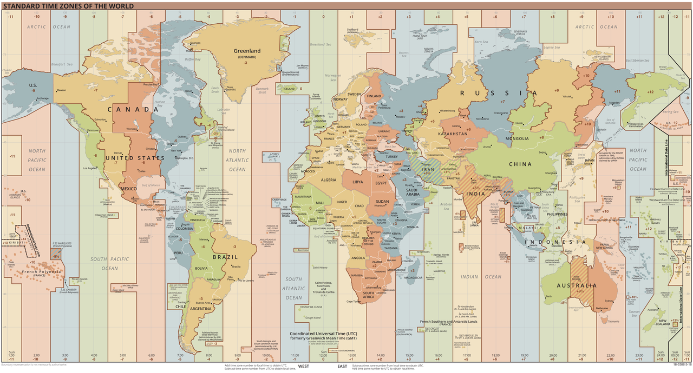

# (PART) SDD IV : pratique {-}

# Données particulières {#data}

```{r setup, results='hide', warning=FALSE, include=FALSE}
SciViews::R
```

Le cours SDD IV, comme son nom l'indique, est essentiellement axé sur la pratique. Le plus gros de votre travail consistera donc à réaliser votre premier gros projet d'analyse de données biologiques. Celui-ci consistera en l'analyse de vos données du travail de fin d'études, ou des données similaires selon le cas.

À part cette partie pratique majoritaire, nous abordons tout de même deux modules supplémentaires. Le premier (celui-ci) s'intéresse aux données particulières\ : dates, données textuelles, données circulaires que vous rencontrerez certainement, si pas dans votre projet pratique, en tous cas plus tard durant votre carrière de biologiste. Le second module du cours (module 8) vous préparera à l'élaboration d'un gros projet scientifique qui diffère des projets que vous avez traités jusqu'ici par le nombre d'étapes et de fichiers plus importants.

##### Objectifs {-}

- Gérer des données autres que numériques et facteurs

- Convertir et utiliser des dates et diverses mesures du temps en général

- Manipuler des informations textuelles, y compris à l'aide d'expressions régulières

- Comprendre, visualiser et analyser des données circulaires

##### Prérequis {-}

Si ce n'est déjà fait, vous devez installer et vous familiariser avec la 'SciViews Box' nouvelle mouture. RStudio et (R) Markdown ne doivent plus avoir de secrets pour vous. Vous devez aussi maîtriser les bases de Git et de GitHub (avoir un compte GitHub, savoir cloner un dépôt localement, travailler avec GitHub Desktop pour faire ses "commits", "push" et "pull"). L'ensemble de ces outils a été abordé dans les cours précédents [SDD I](`r paste(learndown$baseurl, "sdd-umons", sep = "/")`), [SDD II](`r paste(learndown$baseurl, "sdd-umons2", sep = "/")`) et SDD III (les six premiers modules du présent cours) que vous devez avoir réalisé avant d'entamer la matière du cours SDD IV\ : pratique.

## Dates

<!-- G.E.
Tout ce dont on veut parler dans ce module

- date, POSIXlt (POSIXct), lubridate, difftime

- conversion des caractères en date

- anytime

- nanotime

- benchmark
-->

La gestion du temps et les variables de temps peuvent sembler simples d'apparence. Nous pouvons facilement déterminer la date et l'heure qu'il est en regardant une montre et un calendrier. Répondez à la question suivante \:

Est-ce qu'une année dure exactement 365 jours\ ? 

Vous savez que c'est une approximation et que c'est un système complexe que nous allons tenter de simplifier ci-dessous. 

Si on tient compte du calendrier grégorien, des fuseaux horaires, du temps universel coordonné, de l'heure d'été, .... On s'aperçoit que le temps est complexe. 

Le calendrier grégorien est le calendrier le plus utilisé actuellement dans le monde. Ce calendrier définit qu'une année comprend 4 trimestres et 12 mois. Les mois varient en longueur entre 28 et 31 jours. Une semaine comprend 7 jours. Une année comprend 365 jours à l'exception des années bissextiles. Si vous n'avez pas mal de tête, on continue. 

Les fuseaux horaires ont eu pour objectif de définir une heure commune pour un espace géographique déterminé. C'est l'utilisation de chemin de fer qui a rendu la mise en place d'une heure commune indispensable.

En pratique, une échelle de temps est utilisée comme référence par la majorité des pays du globe. Il s'agit du temps universel coordonné (UTC, *coordinated universal time*). Le terme GMT était utilisé précédemment. Il signifiait *Greenwich Mean time*.  A ce temps de référence, on va ajouter ou soustraire un nombre entier (avec des exceptions comme dans tout système avec l'ajout ou la soustraction d'un nombre entier plus 30 ou 45 minutes.)

UTC est un compromis entre le temps atomique international et temps universel. Il faut savoir que le temps universel coordonné est synchronisé avec la rotation de la Terre qui n'est pas fixe. Le service international de la rotation terrestre et des systèmes de référence décide de l'ajout de seconde, une seconde intercalaire (*leap second*) à UTC comme le premier janvier 2009. 



Après avoir lu ces quelques notions, pensez-vous toujours que le temps est simple\ ? 

Comment le temps est-il géré dans R\ ? On retrouve les principaux objets suivant dans R pour gérer les temps\ : `Date`, `POSIXct`, `POSIXlt`, `difftime`. Le package {lubridate} propose en plus `Period`.

L'objet `Date` va s'intéresser au temps exprimé en jours, mois et années. Le jour 0 d'un objet `Date` est par convention le 1970-01-01. Il s'agit de l'heure Unix (mais nous ne détaillerons pas cette notion).

```{r, warning=FALSE, message=FALSE}
library(lubridate)
(date <- as_date(now()))
class(date)
```

L'objet `POSIXt` est un objet plus précis qui tient compte de la date **et de l'heure**. On retrouve deux variantes des objet POSIXT qui sont `POSIXct` et `POSIXlt`. Le POSIXCT enregistre le temps depuis l'origine qui est l'heure Unix alors que le POSIXlt utilise des paramètres attributs spécifiques.

```{r}
(datetime <- now())
class(datetime)
```
Enfin les objets `difftime` sont des objets spécifiques aux différences entre deux dates.

```{r}
(diff <- today() - ymd("1979-10-14"))
# Seconde manière de calculer une différence entre deux dates
diff1 <- difftime(today(), ymd("1979-10-14"))
diff == diff1 # diff et diff1 sont identiques
class(diff)
```

### Conversion d'une chaine de caractères en date

En pratique vous serez souvent amené à convertir des chaînes de caractères en variable de temps. Pour ce faire, le package {lubridate} comprend des fonctions très utile pour convertir des chaînes de caractères en dates. Regardez par vous même pour en déduire la logique simple ci-dessous\ :

- Les dates\ :

```{r}
ymd("2015-Jan-25")
mdy("01/25/15")
```

##### À vous de jouer ! {-}

`r h5p(19, height = 270, toc = "Fonctions de conversion en dates")`

- Les heures\ :

```{r}
hm("01:10 am")
hms("20/10:01")
hms("20:10:01")
```

- Les dates et heures\ :

```{r}
ymd_hm("2010-10-01T2010")
ymd_hms("2015-Jan-25 12:25:35")
```

##### À vous de jouer ! {-}

`r h5p(20, height = 270, toc = "Conversion en dates (2)")`

Par défaut, ce package utilise le temps universel coordonné. Il est cependant possible de définir le fuseau horaire avec l'argument `tz=`.

```{r}
ymd_hms(now(), tz = "Europe/Brussels")
```

Ces fonctions sont capables de gérer des formats de dates différentes en même temps. Essayez cependant d'éviter ce genre d'erreur d'encodage.

```{r}
ymd_hms(c("2015-Jan-25 12:25:35", "2015-01-15T122535", "2015/01/25 12:25:35"),
  tz = "Europe/Brussels")
```

<details>
<summary>Plus de détails...</summary>
Pour avoir plus de flexibilité, il est possible d'utiliser la fonction `parse_date_time()` qui va permettre de spécifier des formats spécifique. 

- Année
    + %Y : 4 chiffres
    + %y : 2 chiffres
- Mois
    + %m : 2 chiffres
    + %b : nom abrégé
    + %B : nom complet
- Jour 
    + %d : 2 chiffres
- Heure
    + %H : 0-23h
    + %i combiné avec %p : 0-12 suivi am/pm
    + %M : minutes
    + %S : secondes entières
    + %OS : secondes réelles
    + %Z : fuseau horaire
    + %z : décalage par rapport à UTC : +0100 (plus 1h)
- Valeurs à ignorer
    + %. : ignore des caractère non numérique
    + %* : ignore une suite de caractères non numériques
</details>

Vous serez un jour confronté à un tableau de données comme suit avec plusieurs colonnes qui renseigne sur le temps de la prise de mesure. 

```{r}
(df <- tibble(
  annee = c(2010, 2011, 2012, 2013),
  mois = c(01, 01, 01, 01),
  jour = c(01, 01, 01, 01)
))
```

Rassurez-vous, il n'est pas nécessaire de combiner les trois colonnes puis de les transformer en variable temporelle. La fonction `make_date()` permet de créer une variable qui combine nos trois colonnes. Il existe la même variante pour `make_datetime()`.

```{r}
df %>.%
  mutate(., date = make_date(annee, mois, jour))
```

##### À vous de jouer ! {-}

```{r, echo=FALSE, results='asis'}
if (exists("assignation"))
  assignation("D07Ga_data", part = "I",
    url = "https://github.com/BioDataScience-Course/D07Ga_data",
    course.urls = c(
      'S-BIOG-043' = "https://classroom.github.com/a/4eN9dBmf"),
    toc = "Données, partie I : dates")
```

### Temps biologique

Lorsque vous étudiez un phénomène biologique, il faut vous poser la question de la temporalité de votre expérience. 

> Est ce que votre expérience dure quelques heures\ ? quelques jours\ ? quelques mois\ ? plusieurs années\ ?

Cette question est cruciale pour traiter vos données. Prenons trois petits cas pratiques théorique. 

- La croissance de coraux sur 30 jours.

Vous réalisez une expérience sur la croissance d'une espèce de corail durant 30 jours en aquarium. Cette expérience débute le 20 septembre 2019.

```{r}
corals <- tibble::tibble(
  weight = 2 + exp(0.02 * 0:29),
  date = lubridate::ymd("2019-09-20") + lubridate::ddays(0:29),
  nb = 0:29
)

corals <- labelise(
  corals,
  label = list(
    weight = "Masse", date = "Date", nb = "Temps"),
  units = list(
    weight = "g", nb = "jour"))

a <- chart(corals, weight ~ date) +
  geom_line() +
  geom_point() 
  
b <- chart(corals, weight ~ nb) +
  geom_line() +
  geom_point()

combine_charts(list(a,b), nrow = 2)
```

On comprend rapidement que le second graphique est plus intéressant. Il n'est pas nécessaire de connaître les dates précises lorsque l'on étudie al croissance d'un organisme dans un aquarium sur 30 jours.

- Le temps perdu dans les embouteillages.

Lorsque l'on étudie le temps perdu dans les bouchons à Bruxelles. Il sera très important de spécifier les jours de la semaine. En effet, nous savons que les bouchons vont varier entre la semaine ou le week-end ou encore lors d'un jour férié. On ne peut donc pas se passer d'une date précise lorsque l'on étudie ce genre de phénomène.

- L'évolution de la température sur 20 ans.

Lorsque l'on étudie des séries temporelles en écologie, on ne s'intéresse pas aux années bissextiles ou qu'un mois dure 29 ou 31 jours. 

Le package {pastecs} propose de diviser une année en multiple de 4, 12, 48 périodes de temps, ... Une fréquence de 48 correspond environ à la semaine. Le tableau ci-dessous représente le temps en biologie.

| Temps | Période |
|-|-|
| Année | 1 |
| mois | 12 |
| semaines | 48 |
| jours | 384 |

En biologie, on va s'intéresser principalement à des cycles particuliers comme le cycle circadien, la succession des saisons, le cycle lunaire,...

##### Pour en savoir plus {-} 

- [Travailler avec des dates dans R](https://dhaine.github.io/clinicR/src/20150506-date.html)

- [Chapter 16 Dates and times in R For Data Science](https://r4ds.had.co.nz/dates-and-times.html)\ : le chapitre 16 traite des variables temporelles.

## Données textuelles

### Encodages

Nous avons tous déjà été confrontés à ce genre de caractères `é` ou `�`. Il s'agit d'un problème d'encodage. Vous avez peut-être déjà entendu les termes suivants ASCII, UTF-8, LATIN1,... 

La problématique est de convertir une chaîne de caractères en bits qui sera interprété par l'ordinateur. Il faut donc attribuer à chaque caractère un code unique. Cette série de codes va permettre la traduction des caractères. Les fameux termes cité précédemment sont les encodages qui permette cette traduction. 

Historiquement, le code américain normalisé pour l’échange d'informations (*ASCII*, "American Standard Code for Information Interchange") a été l'un des premiers système d'encodage proposé. Cet encodage se fait sur 8 bits par caractère, permettant ainsi 256 caractères maximum. Cette proposition était simple et adaptée uniquement à l'anglais. Il ne prenait par exemple pas en compte les accents de la langue française. Il s'en suit du développement de plusieurs systèmes d'encodages avec des adaptions spécifique au très nombreuses langues mondiales comme **ISO 8859** pour les langues latines (*ISO 8859-1*, *latin1*) ou encore ISO-2020 pour les langues asiatiques.

Afin de réduire les problèmes d'encodage, un jeu universel de caractères a ensuite été développé\ : *ISO 10646*. Le consortium Unicode propose une surcouche à cette norme appelé *unicode*. Vous vous en doutez\ : plus il va y avoir des caractères plus le système d'encodage sera lourd et va utiliser un nombre de bits important pour chaque caractère. Le 8-bit limité à 256 caractères est ici largement insuffisant. 

Ainsi, l'*UTF-16* encode chaque caractère sur 16-bit, l'*UTF-32* sur 32-bit parce qu'il faut encore plus de caractères différents et enfin... l'*UTF-8* est apparu et a rapidement mis tout le monde d'accord (du moins dans le monde Unix/Linux et MacOS puisque Windows reste accroché à l'*UTF-16*). Vous allez dire mais là, on revient en arrière si on encode sur 8-bit\ ! Pas tout-à-fait. En fait, avec *UTF-8*, l'encodage est **Variable**. La plupart des caractères courants (a-z, A-Z, 0-9, ponctuations usuelles, etc.) équivalents à l'ASCII sont encodés sur 8-bit. Mais un caractère particulier est vréserver pour indiquer que, pour un caractère particulier, nous passons à 16-bit, ou à 32-bit, ou plus, il n'y a théoriquement pas de limites. Donc, *UTF-8* est compatible avec l'ASCII, compact pour un texte écrit avec des lettres latines, mais parfaitement extensible et théoriquement capable d'encoder une infinité de caractères différents. Le soucis, par contre, c'est qu'il n'est plus possible de déterminer la taille d'un texte en comptant simplement le nombre d'octets qui le compose. Toutes les fonctions de manipulation de textes doivent être adaptées\ !

Nous vous conseillons donc de toujours employer le format **UTF-8** qui est le format le plus universel qui soit. Si votre document ne contient que du texte, des chiffres et des ponctuations usuelles, vous pouvez à la limite vous limiter à ASCII qui est l'encodage qui a la plus large compatibilité. Dans la SciViews Box, l'encodage de textes par défaut est fixé à *UTF-8*, y compris sous Windows pour un maximum de comptabilités et d'inter-opérabilité.

##### Pour en savoir plus {-} 

-  [Encodages de caractères pour débutants](https://www.w3.org/International/questions/qa-what-is-encoding.fr)

- [Tutoriel pour comprendre les encodages](http://sdz.tdct.org/sdz/comprendre-les-encodages.html)

### Manipulation de texte

On utilise des chaînes de caractères dans de nombreux contextes\ : 

- noms de fichiers
- analyse de textes
- analyse de dates 
- coordonnées
- ADN/ARN
- facteur-niveaux
- ...

Afin de manipuler des chaînes de caractères, de nombreuses fonctions sont disponibles dans R. Nous utiliserons principalement les fonctions du package {stringr}.

```{r}
library(stringr)
```

Partons de la chaîne de caractères suivante\ :

```{r}
string <- "Je suis étudiant en science des données biologiques"
```

Quelle est la longueur de cette chaîne de caractère\ ?

```{r}
length(string)
str_length(string) # ou bien la version en R de base nchar(string)
```

Vous attendiez-vous à ces deux résultats\ ? La fonction `length()` renvoie la longueur de l'objet sous forme de vecteur, c'est-à-dire, le nombre d'éléments différents qu'il contient. Ici, il n'y en a donc qu'un seul. La fonction `str_length()` (ou bien `nchar()`) renvoie le nombre de caractères au sein d'une ou plusieurs chaînes de caractères. La phrase stockée dans `string` est formée de `r str_length(string)` caractères. 

Reposons nous la même question cette fois-ci avec un vecteur contenant plusieurs chaînes de caractères.

```{r}
strings <- c("Je suis étudiant en science des données biologiques",
  "Je suis le cours de sdd4",
  "J'aime appliquer les concepts de la science des données lors d'expériences en biologie")

length(strings)
str_length(strings) # ou bien la version en R de base nchar(strings)
```

Cet exemple montre une fois de plus l'importance de lire l'aide d'une fonction et de tenter de faire des tests très simple pour s'assurer de bien comprendre la fonction et ses arguments.

Plaçons-nous maintenant dans un contexte pratique. Au sein d'un laboratoire, vous êtes engagé pour développer une nouvelle méthode de dosage des nitrates. Imaginons que vous avez attribué un identifiant à six expériences que vous avez réalisées en routine lors de dosages des nitrates. Nous pouvons observer que le nom de fichier suit la logique suivante

> nom de l'expérience + numéro de l'expérience + méthode employée + date

```{r}
id <- c(
  "Nitrate.1100.Version1.2019-10-21", "Nitrate.1101.Version2.2019-10-21",
  "Nitrate.1109.Version1.2019-10-24","Nitrate.1110.Version2.2019-10-24",
  "Nitrate.1114.Version1.2019-10-26","Nitrate.1115.Version2.2019-10-26")
id
```

Votre chef vous demande de lui présenter les documents en lien avec les dosages des nitrates version 2, une méthode que vous avez développée. Il est possible de le faire avec une simple instruction.

```{r}
str_subset(id, "Version2")
```
A la suite de votre réunion, votre chef vous demande de modifier le nom de vos dossiers car il ne respecte pas les conventions de notation en vigueur dans le laboratoire. Votre supérieur vous demande donc de remplacer toutes les majuscules par des minuscules. Avec la bonne fonction dans R, cela est réalisable en une seule instruction simple.

```{r}
str_to_lower(id)
```

Il vous demande également de remplacer **tous** les `.` par des `_`. 

```{r}
str_replace_all(id, ".", "_")
```

Vous attendiez-vous à ce résultat\ ? Probablement pas. Avez-vous lu l'aide de la fonction\ ? L'argument `pattern=` (second argument) utilise une **expression régulière** et pas une simple chaîne de caractères. Les expressions régulières sont des outils puissants lorsqu'ils sont judicieusement employés. Nous les étudierons plus loin. Afin de remplacer les `.` par des `_`, il aurait fallu indiquer\ :

```{r}
id %>.%
  stringr::str_to_lower(.) %>.%
  stringr::str_replace_all(., "\\.", "_") -> id_new
id_new
```

En effet, le `.` a une signification particulière lors de l'utilisation de l'expression régulière que nous allons voir dans la section suivante.

##### Pour en savoir plus {-}

- [Introduction to stringr](https://stringr.tidyverse.org/articles/stringr.html)\ : introduction en anglais au package {stringr}.

- [From base R](https://stringr.tidyverse.org/articles/from-base.html)\ : comparaison en anglais entre les fonctions de R de base et les fonctions du package {stringr}.

### Expression régulière

Les expressions régulières servent à manipuler du texte. Elle permettent de rechercher et/ou remplacer des parties de texte dans les chaînes de caractères. Il s'agit pratiquement d'un petit langage en temps que tel pour spécifier ces recherches et remplacements. La syntaxe de base des expressions régulières est très riche, mais en voici quelques cas fréquents pour vous faire une première idée. Pour trouver une chaîne de caractères...

- qui débute par nitrate\ : **"^nitrate"**
- qui termine par nitrate\ : **"nitrate$"**
- qui contient soit nitrate, soit nitrite\ : **"(nitrate|nitrite)"**, ou **"nitr[ai]te"** (ce qui est entre crochet représente les caractères permis à cet emplacement... donc, "a" ou "i")
- qui se répète plusieurs fois\ : 
      + **?** de 0 à 1 fois
      + **+** 1 ou plusieurs
      + __*__ 0 ou plusieurs
      + **{2,6}** répétitions comprise entre 2 et 6 fois
- **.**, n'importe quels caractères
- __.*__ n'importe quels caractères après de longueur quelconque
- **[0-9]** un chiffre de 0 à 9, on peut également utiliser **\\d**
- **[a-z]** une lettre minuscule
– **[A-Z]** une lettre majuscule
- **[a-zA-Z0-9_] une lettre minuscule ou majuscule ou un chiffre, ou le trait souligné `_`
- **[^0-9]** tout caractère sauf un chiffre (le `^` après le crochet ouvrant indique n'importe quoi *sauf* ce qui est précisé à l'intérieur des crochets)

Si je veux rechercher un point je dois écrire `\\.`, car sinon, j'indique que je veux n'importe quel caractère à cet emplacement-là.

##### Exercez-vous {-}

```{block2, type='bdd'}
Il n'est possible de véritablement comprendre les expressions régulières qu'en réalisant des exercices. Nous vous proposons donc de réaliser les exercices proposés sur le site [RegexOne](https://regexone.com/). Les exercices interactifs offrent un niveau de difficulté croissant et balayent les nomtions principales à connaitre pour manipuler les expressions régulières. 
````

Dans R, le package {regexplain} propose des **addins** pour vous aider à utiliser les expressions régulières dans R. Ces expressions régulières sont souvent utilisables dans toutes les fonctions {stringr} que nous avons vu précédemment.

##### À vous de jouer ! {-}

```{r, echo=FALSE, results='asis'}
if (exists("assignation"))
  assignation("D07Ga_data", part = "II",
    url = "https://github.com/BioDataScience-Course/D07Ga_data",
    course.urls = c(
      'S-BIOG-043' = "https://classroom.github.com/a/4eN9dBmf"),
    toc = "Données, partie II : textes")
```

##### Pour en savoir plus {-}

- [Regexone](https://regexone.com/). Tutoriel interactif en anglais pour apprendre a utiliser les expressions régulières.

- [Tutoriel pour maîtriser les expressions régulières](https://www.lucaswillems.com/fr/articles/25/tutoriel-pour-maitriser-les-expressions-regulieres). Article de blog en français pour apprendre les bases des expressions régulières.

### Variables facteurs

Partons d'une expérience sur la croissance de coraux scléractiniaires. Nous avons un vecteur ci-dessous qui correspond au nom abrégé des espèces étudiées. Le nombre d'espèces est fini. Chaque espèce correspond donc à un groupe d'individus d'une même espèce. 

```{r}
species <- c("s.hystrix", "p.damicornis", "a.millepora", "p.damicornis",
  "a.millepora", "s.hystrix", "s.hystrix", "p.damicornis", "a.millepora",
  "p.damicornis", "a.millepora", "s.hystrix", "a.millepora")

species
class(species)
```

Afin de gérer ce type de variable, nous pouvons aussi utiliser les objets **factor** dans R. La gestion correcte des variables facteurs dans R est particulière et peut mener à des erreurs. Nous vous conseillons la lecture de cet article sur le sujet [Wrangling categorical data in R](https://peerj.com/preprints/3163/).

En R de base, la fonction qui permet de transformer une variable en une variable facteur est `factor()`. On retrouve des variantes à ces fonctions comme `as.factor()`, `as.ordered()` (ou encore `as_factor()` du package {forcats}). Nous vous conseillons d'utiliser `factor()` car cette fonction permet une gestion simple des variables facteurs. Il est important de comprendre la logique de gestion des facteurs dans R. Afin de gagner de la mémoire, R va attribuer à chaque niveau d'une variable facteur un nombre entier. Les niveaux vont être attribués par ordre alphabétique par défaut (mais vous pouvez proposer un autre ordre avec l'argument `levels=`).

```{r}
species_f <- factor(species)
species_f

# Niveau de la variable species_f
levels(species_f)
# Entiers associé à ces niveaux
as.integer(species_f)
```
Pour une variable d'une taille conséquente, on s'aperçoit qu'une variable facteur utilise moins d'espace en mémoire qu'une variable caractère.

```{r}
species_length <- sample(species, size = 10000, replace = TRUE)

object.size(species_length)
object.size(as.factor(species_length))
```

Dans notre exemple, l'espace nécessaire est moitié moins important. Rappelez-vous que la première version de R date de 1993. La préoccupation de la mémoire était très importante à l'époque. De nombreuses fonctions plus anciennes vont utilisées de préférence des variables facteurs. Par exemple, la fonction `read.csv()` va par défaut tenter de transformer une variable caractère en une variable facteur alors que la fonction `read_csv()` du package {readr} va laisser la variable en caractère. Nous vous conseillons d'importer vos données en caractère et de les transformer en variable facteur si cela est nécessaire. 

Afin de permettre de travailler plus facilement avec une variable facteur, de nombreuses fonctions sont à votre disposition comme la fonction `recode()` du package {dplyr} ou encore des fonctions disponibles dans le package {forcats}.

```{r}
species_f2 <- recode(species_f,
  "a.millepora"  = "Acropora millepora",
  "p.damicornis" = "Pocillopora damicornis",
  "s.hystrix"    = "Seriatopora hystrix")
species_f2
```

```{block2, type='warning'}
Les variables facteurs sont utiles mais il faut toujours prendre le temps de bien comprendre chaque niveau de la variable. Soyons encore plus vigilant si les données sont amenées à évoluer au cours du temps. 
```

##### Pour en savoir plus {-}

- [Chapter 15 Factors in R For Data Science](https://r4ds.had.co.nz/factors.html) qui traite des variables facteurs.

- [Wrangling categorical data in R](https://peerj.com/preprints/3163/) : un article en anglais sur la différence d'approche entre la gestion des variables facteurs en R de base et avec tidyverse.

- [Introduction to forcats](https://forcats.tidyverse.org/articles/forcats.html) : une introduction en anglais au package {forcats}.

## Variables circulaires

Les variables circulaires se rencontrent de temps en temps en biologie. Lorsque c'est le cas, il est crucial de les reconnaître et de les traiter correctement. Imaginez que vous travaillez sur l'écophysiologie de végétaux. Les conditions météorologiques sont importantes à leur croissance\ : température, humidité, force et direction du vent. Prenons cette dernière variable, direction du vent. Elle peut s'exprimer en degrés de 0 à 360°, 0° correspondant au vent du nord et 180° au vent du sud. Vous enregistrez les données suivantes sur huit jours consécutifs pour la direction du vent en degrés\ :

```{r}
meteo <- tibble(
  day = 1:8,
  wind_dir = c(5, 15, 345, 350, 35, 355, 340, 20)
)
```

Une des premières choses que nous pourrions faire est de calculer la moyenne et l'écart type de ces données\ :

```{r}
mean(meteo$wind_dir)
sd(meteo$wind_dir)
```

Nous en concluons donc qu'en moyenne, le vente est orienté au sud (presque 180°) et est extrêmement variable car l'écart type est de presque 180° également... Vous voyez peut-être déjà le hic ici, sinon, représentons graphiquement ces données. Un graphique naïf donne ceci, par exemple\ :

```{r}
chart(data = meteo, wind_dir ~ day) +
  geom_point() +
  geom_line()
```

Nous avons effectivement l'impression d'un forte et brutale variation de la direction du vent sur ce graphique. Mais si nous nous rappelons qu'en fait 360° = 0°, alors, nous avons un sérieux problème. En effet, si nous avons les observations successives 0° et 360° (donc deux fois la même direction en fait), la moyenne sera\ : (0 + 360) / 2 = 180°, donc pile la direction opposée aux deux observations\ ! Clairement, avec les données circulaires, nous ne pouvons pas ignorer l'arithmétique particulière qui leurs est associée. Des précautions sont également nécessaires pour représenter de telles données graphiquement.

Pour le graphique, nous utiliserons typiquement des coordonnées polaires pour enrouler les données sur elles-mêmes et faire coïncider, ici, 360° avec 0°. Le package {circular} propose des objets et des graphiques adaptés.

```{r}
library(circular)
```

Nous devons d'abord transformer notre variable en objet **circular** à l'aide le fonction `circular()` (voir `?circular` pour les détails concernant ses arguments) en `wind_c`.

```{r}
meteo %>.%
  mutate(., wind_c = circular(wind_dir,
    units = "degrees", template = "geographics")) -> meteo
meteo
```

En apparence, les données n'ont pas été modifiées, mais voyez en haut de colonne. `wind_dir` contient des valeurs numériques `<dbl>` pour doubles, des valeurs numériques à virgule flottante), alors que `wind_c` est de classe **circular**. La fonction `plot()` peut ensuite être appliquée sur cette nouvelle variable `wind_c`\ :

```{r}
plot(meteo$wind_c)
```

Nous voyons clairement ici que le vent que nous avons enregistré est toujours dirigé vers le nord, et jamais au sud comme notre moyenne naïve nous indiquait. A partir du moment où nous avons encodé notre variable de direction de vent correctement comme un objet **circular**, tout devient plus simple car des calculs adaptés sont automatiquement proposés\ :

```{r}
mean(meteo$wind_c)
```

Nous avons donc une moyenne de 3°, soit un vent effectivement orienté nord. De même l'écart type est bien plus petit que le calcul naïf nous faisait croire\ :

```{r}
sd(meteo$wind_c)
```

C'est la "magie" des objets S3 qui opère ici\ : les fonction `mean()`, `sd()`, `plot()` sont dites fonctions génériques dont les **méthodes** varient en fonction de la nature (la classe) de l'objet passé comme premier argument. Le package {circular} implémente des versions particulières de ces fonctions qui tiennent compte des particularités des fonctions circulaires.

### Hirondelles

Maintenant que nous avons compris cela, attaquons-nous à un cas un peu plus complexe. Des scientifiques étudient la capacité des hirondelles rustiques *Hirundo rustica* à se diriger dans leurs migrations grâce au champ magnétique terrestre. Ils capturent une centaine d'hirondelles en migration automnale près de Pise et les placent dans un dispositif qui modifie le champ magnétique terrestre de -90° (groupe `shifted`) ou non (groupe `control`). Ils mesurent la direction que prend chaque individu ensuite. Voyez `?swallows` dans le package {circular} pour plus d'infos. L'objectif est ici de déterminer si les hirondelles utilisent le champ magnétique terrestre pour s'orienter lors de leurs migrations saisonnières.

```{r}
swallows <- read("swallows", package = "circular")
swallows
```

La variable `heading` est la direction initiale prise par chaque hirondelle en degré (0° = nord). Cette variable doit se traiter, donc, comme la direction du vent plus haut (actuellement elle est `<int>` pour `integer`, soit des valeurs numériques entières).

```{r}
swallows <- mutate(swallows, heading = circular(heading,
  units = "degrees", template = "geographics"))
swallows
```

La variable `treatment` correspond aux deux traitements différents\ : `control` et `shifted`. Les hirondelles se répartissent comme ceci entre les traitements\ :

```{r}
table(swallows$treatment)
```

Pour visionner ces données, nous utilisons l'argument `stack = TRUE` qui "empile" les données lorsqu'il y a plusieurs fois la même valeur. L'argument `shrink=` réduit la taille du cercle pour visualiser toutes les données.

```{r}
plot(swallows$heading, stack = TRUE, shrink = 1.1)
```

Nous voulons plutôt visualiser les données pour les deux traitements séparément. Malheureusement, les facettes ou autres astuces ne sont pas disponibles ici. Donc, nous devons ruser en réalisant séparément deux graphiques, en les combinant en une figure unique. Mais attention\ ! Ici, ce sont des graphiques de base. Donc, la combinaison se fait via la division de la zone du graphique en lignes et colonnes à l'aide de `par(mfrow = c(<lignes>, <cols>))`. Ici, nous souhaitons une ligne et deux colonnes. Nous diminuons également les marges avec `mar=`. Enfin, nous annotons les graphiques avec des flèches indiquant la direction moyenne des hirondelles dans chaque traitement à l'aide de `arrows.circular()`.

```{r}
par(mfrow = c(1, 2), mar = c(0, 0, 1.1, 0))
# Contrôles
swallows %>.%
  filter(., treatment == "control") -> swallows_c
plot(swallows_c$heading, stack = TRUE, shrink = 1, col = "darkblue",
    main = "Contrôle")
arrows.circular(mean(swallows_c$heading), col = "darkblue")
# Désorientées
swallows %>.%
  filter(., treatment == "shifted") -> swallows_s
plot(swallows_s$heading, stack = TRUE, shrink = 1, col = "darkred",
    main = "Désorienté")
arrows.circular(mean(swallows_s$heading), col = "darkred")
```

Sur les graphiques, il semble bien que les hirondelles désorientées prennent un cap différent. A ce stade, nous avons besoin d'un test d'hypothèse. Mais ici aussi, les calculs doivent tenir compte des particularités des variables circulaires. Pour une ANOVA à un facteur, {circular} nous gratifie encore une fois d'une fonction adaptée via la méthode `aov()`\ :

```{r}
aov.circular(swallows$heading, group = swallows$treatment)
```

Le tableau de l'ANOVA diffère légèrement, néanmoins nous reconnaissons sa structure classique. La valeur *p* dans la dernière colonne est très faible, et certainement inférieur à un seuil $\alpha$ classique de 5%. Les directions moyennes prises par les hirondelles sont donc significativement différentes entre les deux traitements au seuil $\alpha$ de 5%. Ceci démontre que ces hirondelles utilisent le champ magnétique terrestre pour s'orienter.

Vous avez maintenant compris le principe\ : avec des variables circulaires, nous devons prendre des précautions particulières. Mais à condition d'utiliser les versions graphiques et numériques adaptées, nous pouvons analyser alors correctement nos données.

Les variables circulaires ne sont pas limitées à une orientation dans l'espace. Les cycles (circadiens, saisonniers, ...) peuvent aussi être analysés à l'aide de ce type de variables. En réalité, tout ce qui est cyclique le peut. Par exemple, les huîtres suivent un cycle de croissance gonadique, maturation, ponte, et enfin résorption des gonades lors d'un cycle sexuel. Si les différents stades sont exprimés numériquement (stade 1 à stade 5, le stade 5 étant égal au stade 0), nous pourrons traiter également cette information sous forme d'une variable circulaire. Nous devons juste être attentifs à utiliser les bons arguments dans son encodage à l'aide de la fonction `circular()`.

Outre une orientation dans l'espace avec `template = "geographics"`, `circular()` prend aussi automatiquement en compte les cycles circadiens avec `template = "clock24"`. Voici, par exemple, des données concernant l'heure d'arrivée aux urgences de patients sur une période de 12 mois.

```{r}
hospital <- read("fisherB1", package = "circular")
hospital
```

Nous convertissons en variable circulaire comme ceci\ :

```{r}
hospital <- mutate(hospital, admission = circular(value,
  units = "hours", template = "clock24"))
hospital
```

Effectuons maintenant un graphique différent\ : un histogramme en coordonnées polaires (appelé *rose diagramme* en anglais). 

```{r}
rose.diag(hospital$admission, bin = 24, col = "lightblue",
  main = "Admissions [h]", prop = 3)
```

Nous pouvons obtenir un graphique très similaire avec `chart()` (notez que les limites des classes diffère légèrement).

```{r}
chart(data = hospital, ~admission) +
  geom_histogram(bins = 24, center = 0.5, fill = "lightblue", col = "black") +
  coord_polar(start = 0) +
  scale_x_continuous(breaks = c(0, 3, 6, 9, 12, 15, 18, 21)) +
  theme_minimal() +
  xlab("Admissions [h]") +
  ylab("Dénombrement")
```

Le graphique `chart()` utilises une échelle linéaire, alors que `rose.diag()` utilises par défaut une transformation racine carrée. Pour obtenir un graphique similaire, nous ferons donc (toujours pas parfaitement identique car les limites des classes sont toujours différentes)\ :

```{r}
rose.diag(hospital$admission, bin = 24, col = "lightblue",
  main = "Admissions [h]", prop = 9, radii.scale = "linear")
```

Pour d'autres types de données, nous devons spécifier complètement le système que nous souhaitons utiliser. Pour nos huîtres qui présentes 5 stades de maturité de leurs gonades, nous ferions (données générées artificiellement)\ :

```{r}
set.seed(37843)
oysters <- tibble(
  maturity = sample(1:5, 40, replace = TRUE)
)
oysters
```

Nous pouvons visualiser la distribution en ces 5 stades comme ceci\ :

```{r}
chart(data = oysters, ~ maturity) +
  geom_bar(width = 1, fill = "cornsilk", col = "black") +
  coord_polar(start = 0) +
  scale_x_continuous(breaks = c(1, 2, 3, 4, 5)) +
  theme_minimal() +
  xlab("Maturity stage") +
  ylab("Dénombrement")
```

Pour convertir cette variable `maturity` en variable circulaire, nous ne possédons pas de template. Nous devons convertir nos valeurs de 1 à 5 en radians (en divisant par la valeur max et en multipliant par $2 \pi$).

```{r}
oysters <- mutate(oysters, maturity_c = circular(maturity/5*2*pi,
  rotation = "clock", zero = pi/2))
oysters
```

Le graphique par défaut de {circular} est moins bien que la version `chart()` de l'histogramme avec coordonnées polaires.

```{r}
#plot(oysters$maturity_c, stack = TRUE, shrink = 1.1)
rose.diag(oysters$maturity_c, bins = 5, col = "cornsilk", prop = 3, radii.scale = "linear", axes = FALSE)
```

##### À vous de jouer ! {-}

```{r, echo=FALSE, results='asis'}
if (exists("assignation"))
  assignation("D07Ga_data", part = "III",
    url = "https://github.com/BioDataScience-Course/D07Gb_circular",
    course.urls = c(
      'S-BIOG-043' = "https://classroom.github.com/a/4eN9dBmf"),
    toc = "Données, partie III : variables circulaires")
```

##### Pour en savoir plus {-}

- [Answering biological questions using circular data and analysis in R](https://bigdata.duke.edu/sites/bigdata.duke.edu/files/site-images/FullLesson.html) introduction aux variables circulaires avec R en anglais (exemples intéressants pour le biologiste).

## Récapitulatif des exercices

Ce module vous a permis de prendre connaissance des principes de bases des données temporelles, des données textuelles et des variables circulaires. Pour évaluer votre compréhension de cette matière vous aviez les exercices suivants à réaliser\ :

`r show_ex_toc()`
