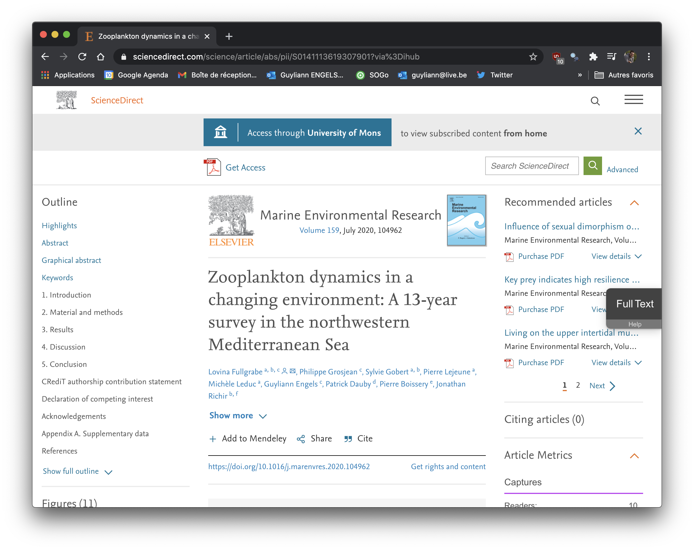
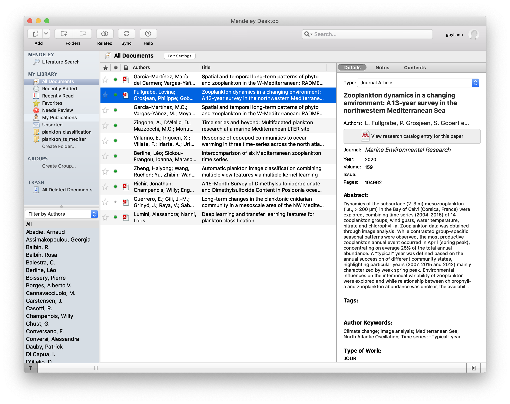

# Projets {#projets}

**Cette section est en cours d'édition**

La réalisation d'un projet scientifique de qualité n'est pas facile. Un projet de qualité n'est pas obligatoirement un projet qui amène à des résultats incroyables, novateurs ou encore révolutionnaires.

Il s'agit d'un projet scientifique qui répond à une question de recherche précise. Il sera composé des éléments suivants :

- des données de qualité avec des métadonnées riches et un protocole d'acquisition clair,
- des carnets de notes (notebook) détaillant les analyses et reproductibles,
- des documents de synthèse pour transmettre les résultats du projet au format le plus approprié (présention, manuscrit, dashboard,...).

Si vous avez travaillé et suivi l'ensemble des cours de sciences de données, vous ne devriez pas être étonné par les 3 éléments cités ci-dessus. Les cours ont été pensé et mis en place pour vous préparer à ce moment. Vous avez toutes les clés pour réaliser un projet de recherche scientifique reproductible de très haute qualité. 

```{block2, type = 'note'}
Ce module ne s'attarde pas sur la pertinence de la question de recherche qui sort du cadre de ce cours. Néanmoins, nous vous proposons une astuce pour gérer votre bibliographie en fin de module.
``` 

## Données de qualité

Nous avons à plusieurs reprises déjà abordé la notion de données de qualité. Avant d'aller plus loin, relisez attentivement les sections suivantes :

- [Acquisition de données](https://wp.sciviews.org/sdd-umons-2020/acquisition-de-donn%C3%A9es.html)

- [Encodage des données dans un tableau cas par variables](https://wp.sciviews.org/sdd-umons-2020/tableaux-de-donn%C3%A9es.html#tableaux-cas-par-variables)

- [Ajout de métadonnées](https://wp.sciviews.org/sdd-umons-2020/tableaux-de-donn%C3%A9es.html#m%C3%A9tadonn%C3%A9es) avec l'utilisation par exemple d'un [dictionnaire des données](https://wp.sciviews.org/sdd-umons-2020/tableaux-de-donn%C3%A9es.html#dictionnaire-des-donn%C3%A9es). 

Il serait de plus très intéressant de pouvoir rendre les données de sa recherche accessible en respectant les normes et les règles de l'[Open Data](https://wp.sciviews.org/sdd-umons2/?iframe=wp.sciviews.org/sdd-umons2-2020/open-data.html). 

Comme vous le voyez, toutes les grandes règles ont déjà été expliquée dans le cadre des cours de sciences de données. La documentation précise et riche des données est une étape longue et fastidieuse. En pratique, elle est très souvent bâclée. 

```{block2, type = 'note'}
En résumé, des données sans documentation sont des données inutilisables.  Elles seront perdues avec le temps. Vous aurez perdu votre temps. Votre objectif sera donc de permettre à une personne externe de comprendre vos données.
```


### Données brutes

Lorsque qu'une expérience est réalisée, les données collectées sont les données brutes. Ces données vont devoir être retravaillés afin d'être exploitable dans les carnets de notes par la suite. 

Voici une petite liste d'étapes à valider pour passer des données brutes à retravaillées : 

- importation des données brutes
- validation des données brutes
    + vérification des types de variables (caractères, facteur, numérique,...)
    + vérification des valeurs obtenues
- calcul de nouvelles variables
- changement du noms des variables (si cela est nécessaire)    
- ajout des labels et unités à chaque variable du jeu de données
- sauvegarde des données retravaillées

## Carnet de notes détaillé

Après avoir collecté vos données, l'étape suivant est d'analyser ces données afin d'en extraire les informations les pertinentes en fonction de la question de recherches. Il s'agit à nouveau d'une étape longue et fastidieuse. 

Vous avez à nouveau déjà eu toutes les clés en main pour mener à bien cette tâche. L'outil le plus efficace est le carnet de notes. Vous utilisez le carnet de notes dans l'ensemble des cours de sciences de données. L'utilisation du Rmarkdown et de git permet d'associer le code et le texte avec un gestionnaire de version. 

Votre objectif sera donc de permettre à une personne externe de comprendre vos analyses grâces à la documentation et au code de votre carnet de notes.


```{block2, type = 'warning'}
Tout bon chercheur doit analyser ces données avant de lancer une nouvelle expérience. 
``` 

## Document de synthèse adapté

Cette dernière étape est en théorie l'étape la plus courte des trois étapes clés de la recherche scientifique reproductible de qualité. Vous avez d'une part des données et des métadonnées riches. D'autre part, vous avez des carnets de notes qui ont analysé vos données. 

Vous devez à présent extraire les éléments les plus pertinents en tenant compte du format de sortie du document de synthèse qui est le plus souvent imposé. 

Il est possible de réaliser 
- un manuscrit avec le package bookdown
- une publication scientifique avec le package rticles
- un poster scientifique avec la package posterdown
- une présentation avec les packages rmarkdown, xaringan, reveal.js, 
- un dashboard avec le package flexdashboard

Ce qui unifie l'ensemble des formats de sortie ci-dessus est qu'ils sont tous rédigé sur la base de document Rmarkdown. Le livre [R Markdown: The Definitive Guide](https://bookdown.org/yihui/rmarkdown/) regroupe un grande partie des formats de sortie possible avec Rmarkdown.

##### A vous de jouer ! {-}

```{r, echo=FALSE, results='asis'}
assignation("D08Ga_project", part = NULL,
  url = "https://github.com/BioDataScience-Course/DD08Ga_project",
  course.urls = c(
    'S-BIOG-043' = "https://classroom.github.com/a/..."),
  toc = "Réalisation d'un projet de recherche")
```

## Astuces

Cette section va comprendre quelques astuces pour améliorer la qualité de vos projets

### Gestion du dépôt Git

Vous l'avez certainement remarqué mais vos projets lié au gestionnaire de version Git ont un fichier qui se nomme `.gitignore`. Jusqu'à présent vous n'avez jamais eu à la modifier. Ce fichier permet d'exclure certains fichiers ou dossiers du gestionnaire de version. 

L'example ci-dessous représente une série d'instruction présente dans un fichier .gitihnore

```
.Rproj.user
.Rhistory
.RData
.Ruserdata

README.html

docs/**.html
docs/**.pdf
docs/**.docx

data/raw
```

Ces instructions vous montrent plusieurs possibilités pour exclure certains fichiers. Les 3 premières instructions permettent d'exclure les fichiers se terminant par ses extensions. Une seconde possibilité est de spécifier un fichier spécifique comme `README.html`. Les trois dernières instructions sont similaires aux trois premières. On va spécifier des extensions à exclure uniquement dans le dossier docs/. Une quatrième solution est d'ignorer le dossier raw complet.

Cela est très utile lorsque l'on a des données brutes trop lourde et qui ne peuvent pas être placées dans le gestionnaire de version. 

### Gestion de la bilbiographie

La réalisation d'une bonne bibliographie est indispensable pour mener à bien un projet de recherche. Il est indispensable d'être à jour sur les dernières recherches proche du sujet de notre recherche. Il faut également veiller à rester à jour. 

Partons de de l'article [Zooplankton dynamics in a changing environment: A 13-year survey in the northwestern Mediterranean Sea](https://www.sciencedirect.com/science/article/abs/pii/S0141113619307901) disponible sur le site ScienceDirect.



Il existe plusieurs outils pour gérer sa bibliographie comme [Mendeley](https://www.mendeley.com/), [EndNote](https://endnote.com/) ou encore [Zotero](https://www.zotero.org/). Nous allons utiliser Mendeley pour cette exemple. Comme le montre la figure ci-dessus, il est possible d'exporter directement la citation de l'article dans Mendeley. Il est également possible d'extraire la citation sur l'onglet Cite. L'onglet cite permet d'exporter une fichier au format .bib, .ris ou encore txt. Ce fichier peut être par la suite ajouté à Mendeley desktop qui est l'application de Mendeley.



Toutes les informations nécessaires sont facilement ajoutées. On est de ce fait sur que les informations sont correctes. Il est également possible d'ajouter le pdf d'un article scientifique. Dans ce cas, l'application va analyser le fichier pour extraire les informations pertinentes pour le citer. Il faut cependant vérifier les informations que l'on peut modifier facilement à droite de l'image présentée ci-dessus.

```{block2, type = 'note'}
Mendeley propose une veille automatique pour vous. Sur base des artciles que vous avez ajouté à votre gestionnaire de bibliographie, Mendeley propose de nouveau article en lien avec les articles présents dans votre gestionnaire.
``` 

Il est possible de faire le lien entre le gestionnaire de bibliographie et les documents Rmarkdown. Dans Mendeley desktop, il est possible d'extraire vos citations en cliquant sur `File > Export...`. Un fichier au format .bib peut être exporté. Ce fichier va être placée dans le projet.

TODO...


## Récapitulatif des exercices

Ce module vous a permis de revoir un ensemble de notions sur la gestion d'un projet scientifiques. Pour évaluer votre compréhension de cette matière vous aviez les exercices suivants à réaliser\ :

`r show_ex_toc()`

